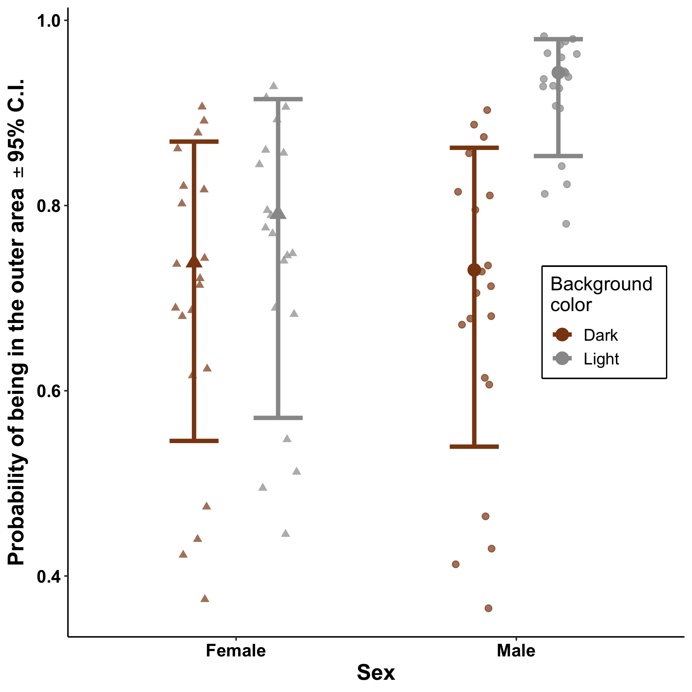

Analysis Summary for Lafferty et al. 2020
================

  - [Repeatability analyses](#repeatability-analyses)
      - [Setup](#setup)
      - [Area explored](#area-explored)
          - [Random effect selection](#random-effect-selection)
          - [Variance and repeatability
            estimates](#variance-and-repeatability-estimates)
      - [Risk-taking](#risk-taking)
          - [Shelter exit latency](#shelter-exit-latency)
          - [Shelter preference](#shelter-preference)
          - [Open-Field location
            preference](#open-field-location-preference)
      - [Background preference](#background-preference)
          - [Random-effect selection](#random-effect-selection-4)
          - [Variance and repeatability
            estimates](#variance-and-repeatability-estimates-3)
      - [Activity](#activity)
          - [Random-effect selection](#random-effect-selection-5)
          - [Variance and repeatability
            estimates](#variance-and-repeatability-estimates-4)
  - [Analyses: Predictors of behavior](#analyses-predictors-of-behavior)
      - [Setup](#setup-1)
          - [Area explored](#area-explored-1)
          - [Risk-taking](#risk-taking-1)
          - [Background preference
            preference](#background-preference-preference)
          - [Activity](#activity-1)
  - [Figures](#figures)
      - [Setup](#setup-2)
      - [Figure 2: Activity during the
        day](#figure-2-activity-during-the-day)
      - [Figure 3: Open-Field location preference during the day, by
        background
        color](#figure-3-open-field-location-preference-during-the-day-by-background-color)
      - [Figure 4: Open-Field location preference, background color and
        sex
        interaction](#figure-4-open-field-location-preference-background-color-and-sex-interaction)

# Repeatability analyses

  - Author: Paul Q. Sims
  - Contact: <paul.q.sims@gmail.com>
  - Date: 2020
  - Purpose: Repeatability analyses and variance estimates for Lafferty
    et al. 2020

<!-- end list -->

``` r
knitr::opts_knit$set(root.dir = rprojroot::find_rstudio_root_file(),
                     eval = TRUE, echo = TRUE, message = FALSE,
                     warning = FALSE, cache = TRUE)
knitr::opts_chunk$set(root.dir = rprojroot::find_rstudio_root_file(),
                     eval = TRUE, echo = TRUE, message = FALSE,
                     warning = FALSE, cache = TRUE)
```

## Setup

``` r
# Load libraries
library(tidyverse)  # for cleaning and modifying data
library(lme4)  # glmer models
library(lmerTest)  # glmer models
library(broom.mixed)  # for tidying model output
library(knitr)  # tidying output
library(glmmTMB)  # for activity analyses

# Load personalized functions
source("R/custom-functions.R")

# Read in data 
# Data collected once each day
data_day <-
  read_csv("data/data_day_LaffertyEtAl_2020.csv",
           col_types = list(exit_fast = col_factor(),
                            trial = col_factor(levels = c("1", "2")),
                            sex = col_factor(levels = c("Female", "Male")))) %>%
  mutate(obsID = 1:nrow(.))  # observation level random effect


# Data collected at time points throughout the day
data_time <-
  read_csv("data/data_time_LaffertyEtAl_2020.csv",
             col_types = list(trial = col_factor(levels = c("1", "2")),
                              sex = col_factor(levels = c("Female", "Male")))) %>%
  mutate(obsID = 1:nrow(.),  # observation level random effect
         across(where(is.character), ~ as_factor(.x)))  

# Data collected at time points throughout the day for lines crossed
data_act <-
  read_csv("data/data_activity_LaffertyEtAl_2020.csv",
             col_types = list(trial = col_factor(levels = c("1", "2")),
                              sex = col_factor(levels = c("Female", "Male")))) %>%
  mutate(obsID = 1:nrow(.),  # observation level random effect
         across(where(is.character), ~ as_factor(.x)))  
```

## Area explored

  - Proportion of unique tiles entered

**Create dataset without NAs**

``` r
data_expl_rpt <- 
  remove_dat_na(data_day, c("uniq_tiles", "tile_fails", "trial",
                            "sex", "ID", "day", "obsID")) %>%
  mutate(expl.y = cbind(uniq_tiles, tile_fails))
```

### Random effect selection

**Test significance of individual intercept (1|ID)**

``` r
# Fit model for adjusted repeatability
m_AdjRpt_expl <- 
  glmer(expl.y ~ trial + sex + (1|ID),  
        family = "binomial", 
        data = data_expl_rpt,
        contrasts = list(trial = c(-1,1), sex = c(-1,1)),
        glmerControl(optimizer="bobyqa",
        optCtrl = list(maxfun = 1e6)))

# Fit null model for testing significance of individual ID
m_AdjRpt_expl_null <- 
  glm(expl.y ~ trial + sex,  
        family = "binomial", 
        data = data_expl_rpt,
        contrasts = list(trial = c(-1,1), sex = c(-1,1)))

# Likelihood ratio test for significance of ind. random effect and rpt
#  Custom functions
rpt_SigTest(m_AdjRpt_expl, m_AdjRpt_expl_null)
```

| npar | AIC    | BIC    | logLik   | deviance | Chisq | Df | p\_value |
| :--- | :----- | :----- | :------- | :------- | :---- | :- | :------- |
| 3    | 224.39 | 229.46 | \-109.20 | 218.39   | NA    | NA | NA       |
| 4    | 211.25 | 218.01 | \-101.63 | 203.25   | 15.14 | 1  | \<0.001  |

Likelihood ratio test for significance of random effect

### Variance and repeatability estimates

``` r
# Adjusted repeatability and variance estimates
# Bootstrap 95% C.I. 
res_boot <- bootMer(m_AdjRpt_expl,  # final rpt model
                    use.u = FALSE,  
                    FUN = rpt_day,  # custom rpt function
                    seed = 1,  # allows exact replication of results
                    nsim = 1000,
                    type = "parametric",
                    parallel = "multicore",
                    .progress = "txt")
```

    ## ================================================================================================

``` r
# Calculate 95% CI
RptConfInt_day(res_boot)
```

| Variable             | Estimate | Lower95CI | Upper95CI |
| :------------------- | :------- | :-------- | :-------- |
| Individual Intercept | 0.17     | 0.02      | 0.36      |
| Residual             | 4.07     | 4.00      | 4.24      |
| Repeatability        | 0.04     | 0.00      | 0.08      |

Variance and repeatability estimates ± 95% CI

## Risk-taking

### Shelter exit latency

  - Exit immediately: yes or no

**Create data set with NA values removed**

``` r
data_shelExit_rpt <- 
  remove_dat_na(data_day, c("exit_fast", "trial",
                            "sex", "ID", "day",
                            "obsID"))
```

#### Random effect selection

**Test significance of individual intercept (1|ID)**

``` r
# Fit model for adjusted repeatability
m_AdjRpt_ExitLat <- 
  glmer(exit_fast ~ trial + sex + (1|ID),  
        family = "binomial", 
        data = data_shelExit_rpt,
        contrasts = list(trial = c(-1,1), sex = c(-1,1)),
        glmerControl(optimizer="bobyqa",
        optCtrl = list(maxfun = 1e6)))

# Fit null model for testing significance of individual ID
m_AdjRpt_ExitLat_null <- 
  glm(exit_fast ~ trial + sex,  
        family = "binomial", 
        data = data_shelExit_rpt,
        contrasts = list(trial = c(-1,1), sex = c(-1,1)))

# Likelihood ratio test for significance of ind. random effect and rpt
rpt_SigTest(m_AdjRpt_ExitLat, m_AdjRpt_ExitLat_null)
```

| npar | AIC   | BIC   | logLik  | deviance | Chisq | Df | p\_value |
| :--- | :---- | :---- | :------ | :------- | :---- | :- | :------- |
| 3    | 54.76 | 59.75 | \-24.38 | 48.76    | NA    | NA | NA       |
| 4    | 54.96 | 61.62 | \-23.48 | 46.96    | 1.79  | 1  | 0.09     |

Likelihood ratio test for significance of random effect

#### Variance and repeatability estimates

``` r
# Variance estimates, including Adjusted repeatability 
rpt_day(m_AdjRpt_ExitLat) %>%
  pretty_DayRpt(.)
```

| Variable             | Estimate |
| :------------------- | :------- |
| Individual Intercept | 2.59     |
| Residual             | 4.06     |
| Repeatability        | 0.39     |

Variance and repeatability estimates

  - 95% C.I. not computed since individual ID is non-significant

### Shelter preference

  - Inside or outside the shelter

**Create data set with NA values removed**

``` r
data_shel_rpt <- 
  remove_dat_na(data_time, c("shelter", "t_point_sc", "trial",
                             "sex", "ID", "trial_series", "day",
                             "obsID"))
```

#### Random-effect selection

**Test significance of individual intercept (1|ID)**

``` r
# Fit base model
m_shel_base <- 
  glmer(shelter ~ t_point_sc * trial + sex +
          (1|ID) + (t_point_sc|trial_series) + (1|obsID),
        data = data_shel_rpt,
        family = "binomial", 
        contrasts = list(trial = c(-1,1), sex = c(-1,1)),
        glmerControl(optimizer="bobyqa",
                    optCtrl = list(maxfun = 1e6)))

# Fit model without individual ID
m_shel_reduc <- refitModelRanEf(m_shel_base,
                                 "(t_point_sc|trial_series) + (1|obsID)")

# LRT for significance of individual ID
rpt_SigTest(m_shel_base, m_shel_reduc)
```

| npar | AIC    | BIC    | logLik   | deviance | Chisq | Df | p\_value |
| :--- | :----- | :----- | :------- | :------- | :---- | :- | :------- |
| 9    | 401.87 | 445.04 | \-191.93 | 383.87   | NA    | NA | NA       |
| 10   | 403.86 | 451.83 | \-191.93 | 383.86   | 0.01  | 1  | 0.47     |

Likelihood ratio test for significance of random effect

``` r
# Non-significant random intercept variance estimate
kable(as_tibble_col(VarCorr(m_shel_base)$ID[1],
      column_name = "Random intercept variance estimate"),
      digits = 2,
      align = "l")
```

| Random intercept variance estimate |
| :--------------------------------- |
| 0.19                               |

**Test significance of individual intercept and time slope correlation
(t\_point\_sc|ID)**

  - Run before testing random slope because result of slope intercept
    will determine which slope model to use

<!-- end list -->

``` r
# Fit model with intercept-slope correlation
m_shel_full <- refitModelRanEf(m_shel_base,
                                 "(t_point_sc|ID) + (t_point_sc|trial_series) +
                                  (1|obsID)")  

# Fit model without intercept-slope m_shel_base
m_shel_reduc <- refitModelRanEf(m_shel_base,
                                 "(0 + t_point_sc|ID) + (1|ID) +
                                  (t_point_sc|trial_series) + (1|obsID)")

# LRT for significance of intercept-slope correlation
rpt_SigTest(m_shel_full, m_shel_reduc)
```

| npar | AIC    | BIC    | logLik   | deviance | Chisq | Df | p\_value |
| :--- | :----- | :----- | :------- | :------- | :---- | :- | :------- |
| 11   | 405.73 | 458.49 | \-191.86 | 383.73   | NA    | NA | NA       |
| 12   | 407.73 | 465.29 | \-191.86 | 383.73   | 0     | 1  | 0.5      |

Likelihood ratio test for significance of random effect

``` r
# print non-significant intercept-slope correlation
kable(as_tibble_col(attr(VarCorr(m_shel_full)$ID,"correlation")[2,1],
      column_name = "Random intercept-slope variance estimate"),
      digits = 2,
      align = "l")
```

| Random intercept-slope variance estimate |
| :--------------------------------------- |
| NaN                                      |

  - Boundary fit due to overly complex random effect structure,
    resulting in individual id estimated as zero and random
    intercept-slope correlation as NaN

**Test significance of time slope (t\_point\_sc)**

``` r
# Fit model with random slope
m_shel_full <- refitModelRanEf(m_shel_base,
                                 "(0 + t_point_sc|ID) + (1|ID) +
                                  (t_point_sc|trial_series) + (1|obsID)")  

# Fit model without random slope
m_shel_reduc <- refitModelRanEf(m_shel_base,
                                 "(1|ID) + (t_point_sc|trial_series) + (1|obsID)")

# LRT for significance of random slope 
rpt_SigTest(m_shel_full, m_shel_reduc)
```

| npar | AIC    | BIC    | logLik   | deviance | Chisq | Df | p\_value |
| :--- | :----- | :----- | :------- | :------- | :---- | :- | :------- |
| 10   | 403.86 | 451.83 | \-191.93 | 383.86   | NA    | NA | NA       |
| 11   | 405.73 | 458.49 | \-191.86 | 383.73   | 0.13  | 1  | 0.36     |

Likelihood ratio test for significance of random effect

``` r
# Non-significant random slope variance estimate
kable(as_tibble_col(VarCorr(m_shel_full)$ID.1[1],
      column_name = "Random slope variance estimate"),
      digits = 2,
      align = "l")
```

| Random slope variance estimate |
| :----------------------------- |
| 0.52                           |

**Test significance of (reaction norm) trial series intercept**

``` r
# Fit model with random intercept
m_shel_full <- refitModelRanEf(m_shel_base,
                                 "(1|ID) + (1|trial_series)")

# Fit model without random intercept
m_shel_reduc <- refitModelRanEf(m_shel_base,
                                 "(1|ID)")

# LRT for significance of intercept
rpt_SigTest(m_shel_full, m_shel_reduc)
```

| npar | AIC    | BIC    | logLik   | deviance | Chisq | Df | p\_value |
| :--- | :----- | :----- | :------- | :------- | :---- | :- | :------- |
| 6    | 573.24 | 602.02 | \-280.62 | 561.24   | NA    | NA | NA       |
| 7    | 494.46 | 528.03 | \-240.23 | 480.46   | 80.79 | 1  | \<0.001  |

Likelihood ratio test for significance of random effect

**Test significance of (reaction norm) trial series intercept and time
slope correlation**

  - Run before testing random slope because result of slope intercept
    will determine which slope model to use

<!-- end list -->

``` r
# Fit model with random intercept-slope correlation
m_shel_full <- refitModelRanEf(m_shel_base,
                                 "(1|ID) + (t_point_sc|trial_series) + (1|obsID)")  

# Fit model without random intercept-slope correlation
m_shel_reduc <- refitModelRanEf(m_shel_base,
                                 "(1|ID) + (0 + t_point_sc|trial_series) +
                                  (1|trial_series) + (1|obsID)")

# LRT for significance of intercept-slope correlation
rpt_SigTest(m_shel_full, m_shel_reduc)
```

| npar | AIC    | BIC    | logLik   | deviance | Chisq | Df | p\_value |
| :--- | :----- | :----- | :------- | :------- | :---- | :- | :------- |
| 9    | 414.80 | 457.97 | \-198.40 | 396.80   | NA    | NA | NA       |
| 10   | 403.86 | 451.83 | \-191.93 | 383.86   | 12.93 | 1  | \<0.001  |

Likelihood ratio test for significance of random effect

**Test significance of (reaction norm) time slope**

``` r
# Fit model with random slope
m_shel_full <- refitModelRanEf(m_shel_base,
                                 "(1|ID) + (t_point_sc|trial_series) + (1|obsID)")  

# Fit model without random slope
m_shel_reduc <- refitModelRanEf(m_shel_base,
                                 "(1|ID) + (1|trial_series) + (1|obsID)")

# LRT for significance of random slope
rpt_SigTest(m_shel_full, m_shel_reduc)
```

| npar | AIC    | BIC    | logLik   | deviance | Chisq | Df | p\_value |
| :--- | :----- | :----- | :------- | :------- | :---- | :- | :------- |
| 8    | 496.46 | 534.83 | \-240.23 | 480.46   | NA    | NA | NA       |
| 10   | 403.86 | 451.83 | \-191.93 | 383.86   | 96.6  | 2  | \<0.001  |

Likelihood ratio test for significance of random effect

**Final random effect model structure**

  - Removed trial series intercept and time slope correlation due to
    model convergence errors during bootstrapping

<!-- end list -->

``` r
m_shel_rpt_final <- 
  glmer(shelter ~ t_point_sc * trial + sex +
          (0 + t_point_sc|trial_series) + (1|trial_series),  
        data = data_shel_rpt,
        family = "binomial", 
        contrasts = list(trial = c(-1,1), sex = c(-1,1)),
        glmerControl(optimizer="bobyqa",
                    optCtrl = list(maxfun = 1e6)))
```

#### Variance estimates

  - Repeatability not calculated since individual intercept and time
    slope estimates were non-significant
  - Removed random series intercept-slope covariance due to convergence
    errors

<!-- end list -->

``` r
# Bootstrap confidence intervals
res_bootOut <-
  bootMer(m_shel_rpt_final,  # final rpt model
          use.u = FALSE,
          FUN = varEst_shel,  # custom variance estimates function
          seed = 1,
          nsim = 1000,
          type = "parametric",
          parallel = "multicore",
          .progress = "txt")
```

    ## ================================================================================================

``` r
# Compile variance estimates 
res_varEst <-
  as_tibble(res_bootOut$t) %>%
  rename("Series Intercept" = "V1",
         "Series Slope" = "V2",
         "Residual" = "V3") %>%
  map_df(~ quantile(.x, c((1 - 0.95)/2, 1 - (1 - 0.95)/2),
                  na.rm = TRUE), .id = "scale") %>%
  rename(Variable = scale, Lower95CI = `2.5%`, Upper95CI = `97.5%`) %>%
  mutate(Estimate = pluck(res_bootOut$t0)) %>%  # add R estimates
  relocate(Variable, Estimate) %>%  # reorder columns
  mutate_at(c(2:4), round, 2)  # # round estimates and errors to 2 digits

kable(res_varEst)
```

| Variable         |  Estimate | Lower95CI | Upper95CI |
| :--------------- | --------: | --------: | --------: |
| Series Intercept |      6.40 |      2.59 |     24.58 |
| Series Slope     |     17.24 |      6.45 |     59.09 |
| Residual         | 109445.31 |      4.39 |       Inf |

### Open-Field location preference

  - Inner vs. outer area of the Open-Field

**Create data set with NA values removed**

``` r
data_of_rpt <- 
  remove_dat_na(data_time, c("of_loc", "t_point_sc", "trial",
                             "sex", "ID", "trial_series", "day",
                             "obsID"))
```

#### Random-effect selection

**Test significance of individual intercept (1|ID)**

``` r
# Fit base model
m_OFloc_base <- 
  glmer(of_loc ~ t_point_sc * trial + sex +
          (1|ID) + (t_point_sc|trial_series),  
        data = data_of_rpt,
        family = "binomial", 
        contrasts = list(trial = c(-1,1), sex = c(-1,1)),
        glmerControl(optimizer="bobyqa",
                    optCtrl = list(maxfun = 1e6)))

# Fit model without individual ID
m_OFloc_reduc <- refitModelRanEf(m_OFloc_base,
                                 "(t_point_sc|trial_series)")

# LRT for significance of individual ID
rpt_SigTest(m_OFloc_base, m_OFloc_reduc)
```

| npar | AIC    | BIC    | logLik   | deviance | Chisq | Df | p\_value |
| :--- | :----- | :----- | :------- | :------- | :---- | :- | :------- |
| 8    | 905.14 | 943.51 | \-444.57 | 889.14   | NA    | NA | NA       |
| 9    | 902.03 | 945.20 | \-442.01 | 884.03   | 5.11  | 1  | 0.012    |

Likelihood ratio test for significance of random effect

**Test significance of individual intercept and time slope correlation
(t\_point\_sc|ID)**

  - Run before testing random slope because result of slope intercept
    will determine which slope model to use

<!-- end list -->

``` r
# Fit model with intercept-slope correlation
m_OFloc_full <- refitModelRanEf(m_OFloc_base,
                                 "(t_point_sc|ID) + (t_point_sc|trial_series)")  

# Fit model without intercept-slope m_OFloc_base
m_OFloc_reduc <- refitModelRanEf(m_OFloc_base,
                                 "(0 + t_point_sc|ID) + (1|ID) +
                                  (t_point_sc|trial_series)")

# LRT for significance of intercept-slope correlation
rpt_SigTest(m_OFloc_full, m_OFloc_reduc)
```

| npar | AIC    | BIC    | logLik   | deviance | Chisq | Df | p\_value |
| :--- | :----- | :----- | :------- | :------- | :---- | :- | :------- |
| 10   | 904.03 | 952.00 | \-442.01 | 884.03   | NA    | NA | NA       |
| 11   | 904.53 | 957.29 | \-441.26 | 882.53   | 1.5   | 1  | 0.11     |

Likelihood ratio test for significance of random effect

``` r
# print non-significant intercept-slope correlation
kable(as_tibble_col(attr(VarCorr(m_OFloc_full)$ID,"correlation")[2,1],
      column_name = "Random intercept-slope variance estimate"),
      digits = 2,
      align = "l")
```

| Random intercept-slope variance estimate |
| :--------------------------------------- |
| 1                                        |

**Test significance of time slope (t\_point\_sc)**

``` r
# Fit model with random slope
m_OFloc_full <- refitModelRanEf(m_OFloc_base,
                                 "(0 + t_point_sc|ID) + (1|ID) +
                                  (t_point_sc|trial_series)") 

# Fit model without random slope
m_OFloc_reduc <- refitModelRanEf(m_OFloc_base,
                                 "(1|ID) + (t_point_sc|trial_series)")

# LRT for significance of random slope 
rpt_SigTest(m_OFloc_full, m_OFloc_reduc)
```

| npar | AIC    | BIC   | logLik   | deviance | Chisq | Df | p\_value |
| :--- | :----- | :---- | :------- | :------- | :---- | :- | :------- |
| 9    | 902.03 | 945.2 | \-442.01 | 884.03   | NA    | NA | NA       |
| 10   | 904.03 | 952.0 | \-442.01 | 884.03   | 0     | 1  | 0.5      |

Likelihood ratio test for significance of random effect

``` r
# Non-significant random slope variance estimate
kable(as_tibble_col(VarCorr(m_OFloc_full)$ID.1[1],
      column_name = "Random slope variance estimate"),
      digits = 2,
      align = "l")
```

| Random slope variance estimate |
| :----------------------------- |
| 0                              |

**Test significance of (reaction norm) trial series intercept**

``` r
# Fit model with random intercept
m_OFloc_full <- refitModelRanEf(m_OFloc_base,
                                 "(1|ID) + (1|trial_series)")  

# Fit model without random intercept
m_OFloc_reduc <- refitModelRanEf(m_OFloc_base,
                                 "(1|ID)")

# LRT for significance of intercept
rpt_SigTest(m_OFloc_full, m_OFloc_reduc)
```

| npar | AIC    | BIC    | logLik   | deviance | Chisq | Df | p\_value |
| :--- | :----- | :----- | :------- | :------- | :---- | :- | :------- |
| 6    | 948.44 | 977.22 | \-468.22 | 936.44   | NA    | NA | NA       |
| 7    | 924.01 | 957.59 | \-455.01 | 910.01   | 26.43 | 1  | \<0.001  |

Likelihood ratio test for significance of random effect

**Test significance of (reaction norm) trial series intercept and time
slope correlation**

  - Run before testing random slope b/c result of slope intercept will
    determine which slope model to use

<!-- end list -->

``` r
# Fit model with random intercept-slope correlation
m_OFloc_full <- refitModelRanEf(m_OFloc_base,
                                 "(1|ID) + (t_point_sc|trial_series)")  

# Fit model without random intercept-slope correlation
m_OFloc_reduc <- refitModelRanEf(m_OFloc_base,
                                 "(1|ID) + (0 + t_point_sc|trial_series) +
                                  (1|trial_series)")

# LRT for significance of intercept-slope correlation
rpt_SigTest(m_OFloc_full, m_OFloc_reduc)
```

| npar | AIC    | BIC    | logLik   | deviance | Chisq | Df | p\_value |
| :--- | :----- | :----- | :------- | :------- | :---- | :- | :------- |
| 8    | 907.46 | 945.84 | \-445.73 | 891.46   | NA    | NA | NA       |
| 9    | 902.03 | 945.20 | \-442.01 | 884.03   | 7.43  | 1  | 0.003    |

Likelihood ratio test for significance of random effect

**Test significance of (reaction norm) time slope**

``` r
# Fit model with random slope
m_OFloc_full <- refitModelRanEf(m_OFloc_base,
                                 "(1|ID) + (t_point_sc|trial_series)")  

# Fit model without random slope
m_OFloc_reduc <- refitModelRanEf(m_OFloc_base,
                                 "(1|ID) + (1|trial_series)")

# LRT for significance of random slope
rpt_SigTest(m_OFloc_full, m_OFloc_reduc)
```

| npar | AIC    | BIC    | logLik   | deviance | Chisq | Df | p\_value |
| :--- | :----- | :----- | :------- | :------- | :---- | :- | :------- |
| 7    | 924.01 | 957.59 | \-455.01 | 910.01   | NA    | NA | NA       |
| 9    | 902.03 | 945.20 | \-442.01 | 884.03   | 25.98 | 2  | \<0.001  |

Likelihood ratio test for significance of random effect

**Final random effect model structure**

  - Removed trial series intercept and time slope correlation due to
    model convergence errors during bootstrapping

<!-- end list -->

``` r
m_OFloc_rpt_final <- 
  glmer(of_loc ~ t_point_sc * trial + sex +
          (1|ID) + (0 + t_point_sc|trial_series) + (1|trial_series),  
        data = data_of_rpt,
        family = "binomial", 
        contrasts = list(trial = c(-1,1), sex = c(-1,1)),
        glmerControl(optimizer="bobyqa",
                    optCtrl = list(maxfun = 1e6)))
```

#### Variance and repeatability estimates

``` r
# Bootstrap confidence intervals
res_bootOut <- 
  bootMer(m_OFloc_rpt_final,  # final rpt model 
          use.u = FALSE, 
          FUN = varEst_OF,  # custom variance estimates function
          seed = 1,
          nsim = 1000,  
          type = "parametric",
          parallel = "multicore",
          .progress = "txt")
```

    ## ================================================================================================

``` r
# Compile variance and repeatability estimates 
res_varEst <- 
  as_tibble(res_bootOut$t) %>%
  rename("Individual Intercept" = "V1",
         "Series Intercept" = "V2",
         "Series Slope" = "V3",
         "Residual" = "V4",
         "Reaction Norm Intercept Repeatability" = "V5",
         "Long-term Repeatability" = "V6") %>%
  map_df(~ quantile(.x, c((1 - 0.95)/2, 1 - (1 - 0.95)/2),  # calculate 95CI from bootstrap
                  na.rm = TRUE), .id = "scale") %>%
  rename(Variable = scale, Lower95CI = `2.5%`, Upper95CI = `97.5%`) %>%
  mutate(Estimate = pluck(res_bootOut$t0)) %>%  # add R estimates
  relocate(Variable, Estimate) %>%  # reorder columns
  mutate_at(c(2:4), round, 2)  # # round estimates and errors to 2 digits

kable(res_varEst)
```

| Variable                              | Estimate | Lower95CI | Upper95CI |
| :------------------------------------ | -------: | --------: | --------: |
| Individual Intercept                  |     1.24 |      0.07 |      2.51 |
| Series Intercept                      |     0.86 |      0.19 |      1.72 |
| Series Slope                          |     0.43 |      0.07 |      0.78 |
| Residual                              |     4.75 |      4.21 |      5.97 |
| Reaction Norm Intercept Repeatability |     0.59 |      0.05 |      0.91 |
| Long-term Repeatability               |     0.17 |      0.01 |      0.31 |

## Background preference

  - Dark background: yes or no

**Create data set with NA values removed**

``` r
data_bkgrd_rpt <- 
  remove_dat_na(data_time, c("bkgrd", "t_point_sc", "trial",
                             "sex", "ID", "trial_series", "day",
                             "obsID"))
```

### Random-effect selection

**Test significance of individual intercept (1|ID)**

``` r
# Fit base model
m_bkgrd_base <- 
  glmer(bkgrd ~ t_point_sc * trial + sex +
          (1|ID) + (t_point_sc|trial_series), 
        data = data_bkgrd_rpt,
        family = "binomial", 
        contrasts = list(trial = c(-1,1), sex = c(-1,1)),
        glmerControl(optimizer="bobyqa",
                    optCtrl = list(maxfun = 1e6)))

# Fit model without individual ID
m_bkgrd_reduc <- refitModelRanEf(m_bkgrd_base,
                                 "(t_point_sc|trial_series)")

# LRT for significance bkgrd individual ID
rpt_SigTest(m_bkgrd_base, m_bkgrd_reduc)
```

| npar | AIC    | BIC    | logLik   | deviance | Chisq | Df | p\_value |
| :--- | :----- | :----- | :------- | :------- | :---- | :- | :------- |
| 8    | 713.64 | 752.02 | \-348.82 | 697.64   | NA    | NA | NA       |
| 9    | 705.56 | 748.74 | \-343.78 | 687.56   | 10.08 | 1  | \<0.001  |

Likelihood ratio test for significance of random effect

**Test significance of individual intercept and time slope correlation
(t\_point\_sc|ID)**

  - Run before testing random slope because result background slope
    intercept will determine which slope model to use

<!-- end list -->

``` r
# Fit model with intercept-slope correlation
m_bkgrd_full <- refitModelRanEf(m_bkgrd_base,
                                 "(t_point_sc|ID) + (t_point_sc|trial_series)")  

# Fit model without intercept-slope m_bkgrd_base
m_bkgrd_reduc <- refitModelRanEf(m_bkgrd_base,
                                 "(0 + t_point_sc|ID) + (1|ID) +
                                  (t_point_sc|trial_series)")

# LRT for significance bkgrd intercept-slope correlation
rpt_SigTest(m_bkgrd_full, m_bkgrd_reduc)
```

| npar | AIC    | BIC    | logLik   | deviance | Chisq | Df | p\_value |
| :--- | :----- | :----- | :------- | :------- | :---- | :- | :------- |
| 10   | 707.56 | 755.53 | \-343.78 | 687.56   | NA    | NA | NA       |
| 11   | 704.22 | 756.98 | \-341.11 | 682.22   | 5.35  | 1  | 0.01     |

Likelihood ratio test for significance of random effect

``` r
# print significant intercept-slope correlation
kable(as_tibble_col(attr(VarCorr(m_bkgrd_full)$ID,"correlation")[2,1],
      column_name = "Random intercept-slope variance estimate"),
      digits = 2, 
      align = "l")
```

| Random intercept-slope variance estimate |
| :--------------------------------------- |
| 0.88                                     |

**Test significance of time slope (t\_point\_sc)**

``` r
# Fit model with random slope
m_bkgrd_full <- refitModelRanEf(m_bkgrd_base,
                                 "(t_point_sc|ID) +
                                  (t_point_sc|trial_series)") 

# Fit model without random slope
m_bkgrd_reduc <- refitModelRanEf(m_bkgrd_base,
                                 "(1|ID) + (t_point_sc|trial_series)")

# LRT for significance bkgrd random slope 
rpt_SigTest(m_bkgrd_full, m_bkgrd_reduc)
```

| npar | AIC    | BIC    | logLik   | deviance | Chisq | Df | p\_value |
| :--- | :----- | :----- | :------- | :------- | :---- | :- | :------- |
| 9    | 705.56 | 748.74 | \-343.78 | 687.56   | NA    | NA | NA       |
| 11   | 704.22 | 756.98 | \-341.11 | 682.22   | 5.35  | 2  | 0.035    |

Likelihood ratio test for significance of random effect

**Test significance of (reaction norm) trial series intercept**

``` r
# Fit model with random intercept
m_bkgrd_full <- refitModelRanEf(m_bkgrd_base,
                                 "(t_point_sc|ID) + (1|trial_series)")

# Fit model without random intercept
m_bkgrd_reduc <- refitModelRanEf(m_bkgrd_base,
                                 "(t_point_sc|ID)")

# LRT for significance bkgrd intercept
rpt_SigTest(m_bkgrd_full, m_bkgrd_reduc)
```

| npar | AIC    | BIC    | logLik   | deviance | Chisq | Df | p\_value |
| :--- | :----- | :----- | :------- | :------- | :---- | :- | :------- |
| 8    | 754.25 | 792.62 | \-369.12 | 738.25   | NA    | NA | NA       |
| 9    | 728.70 | 771.88 | \-355.35 | 710.70   | 27.54 | 1  | \<0.001  |

Likelihood ratio test for significance of random effect

**Test significance of (reaction norm) trial series intercept and time
slope correlation**

  - Run before testing random slope b/c result bkgrd slope intercept
    will determine which slope model to use

<!-- end list -->

``` r
# Fit model with random intercept-slope correlation
m_bkgrd_full <- refitModelRanEf(m_bkgrd_base,
                                 "(t_point_sc|ID) + (t_point_sc|trial_series)")  

# Fit model without random intercept-slope correlation
m_bkgrd_reduc <- refitModelRanEf(m_bkgrd_base,
                                 "(t_point_sc|ID) + (0 + t_point_sc|trial_series) +
                                  (1|trial_series)")

# LRT for significance bkgrd intercept-slope correlation
rpt_SigTest(m_bkgrd_full, m_bkgrd_reduc)
```

| npar | AIC    | BIC    | logLik   | deviance | Chisq | Df | p\_value |
| :--- | :----- | :----- | :------- | :------- | :---- | :- | :------- |
| 10   | 718.32 | 766.29 | \-349.16 | 698.32   | NA    | NA | NA       |
| 11   | 704.22 | 756.98 | \-341.11 | 682.22   | 16.1  | 1  | \<0.001  |

Likelihood ratio test for significance of random effect

``` r
# print significant intercept-slope correlation
kable(as_tibble_col(attr(VarCorr(m_bkgrd_full)$trial_series,"correlation")[2,1],
      column_name = "Random intercept-slope variance estimate"),
      digits = 2,
      align = "l")
```

| Random intercept-slope variance estimate |
| :--------------------------------------- |
| 1                                        |

**Test significance of (reaction norm) time slope**

``` r
# Fit model with random slope
m_bkgrd_full <- refitModelRanEf(m_bkgrd_base,
                                 "(t_point_sc|ID) + (t_point_sc|trial_series)")  

# Fit model without random slope
m_bkgrd_reduc <- refitModelRanEf(m_bkgrd_base,
                                 "(t_point_sc|ID) + (1|trial_series)")

# LRT for significance bkgrd random slope
rpt_SigTest(m_bkgrd_full, m_bkgrd_reduc)
```

| npar | AIC    | BIC    | logLik   | deviance | Chisq | Df | p\_value |
| :--- | :----- | :----- | :------- | :------- | :---- | :- | :------- |
| 9    | 728.70 | 771.88 | \-355.35 | 710.70   | NA    | NA | NA       |
| 11   | 704.22 | 756.98 | \-341.11 | 682.22   | 28.49 | 2  | \<0.001  |

Likelihood ratio test for significance of random effect

**Final random effect model structure**

  - Removed intercept and time slope correlations for trial series and
    individual ID due to model convergence errors during bootstrapping

<!-- end list -->

``` r
# Refit without random effect covariances due to singular fits
m_bkgrd_rpt_final <- 
  glmer(bkgrd ~ t_point_sc * trial + sex +
          (0 + t_point_sc|ID) + (1|ID) + (0 + t_point_sc|trial_series) + (1|trial_series),  
        data = data_bkgrd_rpt,
        family = "binomial", 
        contrasts = list(trial = c(-1,1), sex = c(-1,1)),
        glmerControl(optimizer="bobyqa",
                    optCtrl = list(maxfun = 1e6)))
```

### Variance and repeatability estimates

``` r
# Bootstrap confidence intervals
res_bootOut <- 
  bootMer(m_bkgrd_rpt_final,  # final rpt model 
          use.u = FALSE, 
          FUN = varEst_bkgrd,  # custom variance estimates function
          seed = 1,
          nsim = 1000,  
          type = "parametric",
          parallel = "multicore",
          .progress = "txt")
```

    ## ================================================================================================

``` r
# Compile variance and repeatability estimates 
res_varEst <- 
  as_tibble(res_bootOut$t) %>%
  rename("Individual Intercept" = "V1",
         "Individual Slope" = "V2",
         "Series Intercept" = "V3",
         "Series Slope" = "V4",
         "Residual" = "V5",
         "Reaction Norm Intercept Repeatability" = "V6",
         "Reaction Norm Slope Repeatability" = "V7",
         "Long-term Repeatability" = "V8") %>%
  map_df(~ quantile(.x, c((1 - 0.95)/2, 1 - (1 - 0.95)/2),  # calculate 95CI from bootstrap
                  na.rm = TRUE), .id = "scale") %>%
  rename(Variable = scale, Lower95CI = `2.5%`, Upper95CI = `97.5%`) %>%
  mutate(Estimate = pluck(res_bootOut$t0)) %>%  # add R estimates
  relocate(Variable, Estimate) %>%  # reorder columns
  mutate_at(c(2:4), round, 2)  # # round estimates and errors to 2 digits

kable(res_varEst)
```

| Variable                              | Estimate | Lower95CI | Upper95CI |
| :------------------------------------ | -------: | --------: | --------: |
| Individual Intercept                  |     3.55 |      0.80 |      7.23 |
| Individual Slope                      |     0.80 |      0.00 |      2.18 |
| Series Intercept                      |     1.15 |      0.18 |      2.44 |
| Series Slope                          |     0.79 |      0.00 |      1.67 |
| Residual                              |     4.46 |      4.02 |      5.78 |
| Reaction Norm Intercept Repeatability |     0.75 |      0.36 |      0.96 |
| Reaction Norm Slope Repeatability     |     0.50 |      0.00 |      1.00 |
| Long-term Repeatability               |     0.33 |      0.09 |      0.52 |

## Activity

  - Number of lines crossed

**Create data set with NA values removed**

``` r
data_act_rpt <- 
  remove_dat_na(data_act, c("line_cross", "t_point_sc", "trial",
                            "sex", "ID", "trial_series", "day",
                            "obsID"))
```

### Random-effect selection

**Test significance of individual intercept (1|ID)**

``` r
# Fit base model
m_act_base <- 
  glmmTMB(line_cross ~ t_point_sc * trial + sex +
            (1|ID) + (t_point_sc|trial_series),
          data = data_act_rpt,
          contrasts = list(trial = c(-1,1), sex = c(-1,1)),
          ziformula= ~ 1,
          family="nbinom2")

# Fit model without individual ID
m_act_reduc <- refitModelRanEf(m_act_base,
                                 "(t_point_sc|trial_series)")

# LRT for significance act individual ID
rpt_SigTest(m_act_base, m_act_reduc)
```

| Df | AIC     | BIC     | logLik    | deviance | Chisq | Chi Df | p\_value |
| :- | :------ | :------ | :-------- | :------- | :---- | :----- | :------- |
| 10 | 6567.80 | 6625.75 | \-3273.90 | 6547.80  | NA    | NA     | NA       |
| 11 | 6547.79 | 6611.53 | \-3262.89 | 6525.79  | 22.01 | 1      | \<0.001  |

Likelihood ratio test for significance of random effect

**Test significance of individual intercept and time slope correlation
(t\_point\_sc|ID)**

  - Run before testing random slope because result act slope intercept
    will determine which slope model to use

<!-- end list -->

``` r
# Fit model with intercept-slope correlation
m_act_full <- refitModelRanEf(m_act_base,
                                 "(t_point_sc|ID) + (t_point_sc|trial_series)")  

# Fit model without intercept-slope m_act_base
m_act_reduc <- refitModelRanEf(m_act_base,
                                 "(0 + t_point_sc|ID) + (1|ID) +
                                  (t_point_sc|trial_series)")

# LRT for significance act intercept-slope correlation
rpt_SigTest(m_act_full, m_act_reduc)
```

| Df | AIC     | BIC     | logLik    | deviance | Chisq | Chi Df | p\_value |
| :- | :------ | :------ | :-------- | :------- | :---- | :----- | :------- |
| 12 | 6549.79 | 6619.32 | \-3262.89 | 6525.79  | NA    | NA     | NA       |
| 13 | 6551.08 | 6626.41 | \-3262.54 | 6525.08  | 0.71  | 1      | 0.2      |

Likelihood ratio test for significance of random effect

``` r
# print significant intercept-slope correlation
kable(as_tibble_col(attr(VarCorr(m_act_full)$cond$ID,"correlation")[1,2],
      column_name = "Random intercept-slope variance estimate"),
      digits = 2,
      align = "l")
```

| Random intercept-slope variance estimate |
| :--------------------------------------- |
| 1                                        |

**Test significance of time slope (t\_point\_sc)**

``` r
# Fit model with random slope
m_act_full <- refitModelRanEf(m_act_base,
                                 "(t_point_sc|ID) + 
                                  (t_point_sc|trial_series)") 

# Fit model without random slope
m_act_reduc <- refitModelRanEf(m_act_base,
                                 "(1|ID) + (t_point_sc|trial_series)")

# LRT for significance act random slope 
rpt_SigTest(m_act_full, m_act_reduc)
```

| Df | AIC     | BIC     | logLik    | deviance | Chisq | Chi Df | p\_value |
| :- | :------ | :------ | :-------- | :------- | :---- | :----- | :------- |
| 11 | 6547.79 | 6611.53 | \-3262.89 | 6525.79  | NA    | NA     | NA       |
| 13 | 6551.08 | 6626.41 | \-3262.54 | 6525.08  | 0.71  | 2      | 0.35     |

Likelihood ratio test for significance of random effect

``` r
# print non-significant random slope
kable(as_tibble_col(VarCorr(m_act_full)$cond$ID[2,2],
      column_name = "Random slope variance estimate"),
      digits = 2,
      align = "l")
```

| Random slope variance estimate |
| :----------------------------- |
| 0.06                           |

**Test significance of (reaction norm) trial series intercept**

``` r
# Fit model with random intercept
m_act_full <- refitModelRanEf(m_act_base,
                                 "(1|ID) + (1|trial_series)")

# Fit model without random intercept
m_act_reduc <- refitModelRanEf(m_act_base,
                                 "(1|ID)")

# LRT for significance act intercept
rpt_SigTest(m_act_full, m_act_reduc)
```

| Df | AIC     | BIC     | logLik    | deviance | Chisq | Chi Df | p\_value |
| :- | :------ | :------ | :-------- | :------- | :---- | :----- | :------- |
| 8  | 6659.68 | 6706.04 | \-3321.84 | 6643.68  | NA    | NA     | NA       |
| 9  | 6637.31 | 6689.46 | \-3309.66 | 6619.31  | 24.37 | 1      | \<0.001  |

Likelihood ratio test for significance of random effect

**Test significance of (reaction norm) trial series intercept and time
slope correlation**

  - Run before testing random slope b/c result act slope intercept will
    determine which slope model to use

<!-- end list -->

``` r
# Fit model with random intercept-slope correlation
m_act_full <- refitModelRanEf(m_act_base,
                                 "(1|ID) + (t_point_sc|trial_series)")  

# Fit model without random intercept-slope correlation
m_act_reduc <- refitModelRanEf(m_act_base,
                                 "(1|ID) + (0 + t_point_sc|trial_series) +
                                  (1|trial_series)")

# LRT for significance act intercept-slope correlation
rpt_SigTest(m_act_full, m_act_reduc)
```

| Df | AIC     | BIC     | logLik    | deviance | Chisq | Chi Df | p\_value |
| :- | :------ | :------ | :-------- | :------- | :---- | :----- | :------- |
| 10 | 6564.30 | 6622.25 | \-3272.15 | 6544.30  | NA    | NA     | NA       |
| 11 | 6547.79 | 6611.53 | \-3262.89 | 6525.79  | 18.52 | 1      | \<0.001  |

Likelihood ratio test for significance of random effect

``` r
# print significant intercept-slope correlation
kable(as_tibble_col(attr(VarCorr(m_act_full)$cond$trial_series,"correlation")[1,2],
      column_name = "Random intercept-slope variance estimate"),
      digits = 2,
      align = "l")
```

| Random intercept-slope variance estimate |
| :--------------------------------------- |
| 0.94                                     |

**Test significance of (reaction norm) time slope**

``` r
# Fit model with random slope
m_act_full <- refitModelRanEf(m_act_base,
                                 "(1|ID) + (t_point_sc|trial_series)")  

# Fit model without random slope
m_act_reduc <- refitModelRanEf(m_act_base,
                                 "(1|ID) + (1|trial_series)")

# LRT for significance act random slope
rpt_SigTest(m_act_full, m_act_reduc)
```

| Df | AIC     | BIC     | logLik    | deviance | Chisq | Chi Df | p\_value |
| :- | :------ | :------ | :-------- | :------- | :---- | :----- | :------- |
| 9  | 6637.31 | 6689.46 | \-3309.66 | 6619.31  | NA    | NA     | NA       |
| 11 | 6547.79 | 6611.53 | \-3262.89 | 6525.79  | 93.53 | 2      | \<0.001  |

Likelihood ratio test for significance of random effect

**Final random effect model structure**

  - Removed trial series intercept and time slope correlation due to
    model convergence errors during bootstrapping

<!-- end list -->

``` r
m_act_rpt_final <- 
  glmmTMB(line_cross ~ t_point_sc * trial + sex +
            (1|ID) + (0 + t_point_sc|trial_series) + (1|trial_series),
          data = data_act_rpt,
          contrasts = list(trial = c(-1,1), sex = c(-1,1)),
          ziformula= ~ 1,
          family="nbinom2")
```

### Variance and repeatability estimates

``` r
# Bootstrap confidence intervals
res_bootOut <- 
  bootMer(m_act_rpt_final,  # final rpt model 
          use.u = FALSE, 
          FUN = varEst_act,  # custom variance estimates function
          seed = 1,
          nsim = 1000,  
          type = "parametric",
          parallel = "multicore",
          .progress = "txt")
```

    ## ================================================================================================

``` r
# Compile variance and repeatability estimates 
res_varEst <- 
  as_tibble(res_bootOut$t) %>%
  rename("Individual Intercept" = "V1",
         "Series Intercept" = "V2",
         "Series Slope" = "V3",
         "Residual" = "V4",
         "Reaction Norm Intercept Repeatability" = "V5",
         "Long-term Repeatability" = "V6") %>%
  map_df(~ quantile(.x, c((1 - 0.95)/2, 1 - (1 - 0.95)/2),  # calculate 95CI from bootstrap
                  na.rm = TRUE), .id = "scale") %>%
  rename(Variable = scale, Lower95CI = `2.5%`, Upper95CI = `97.5%`) %>%
  mutate(Estimate = pluck(res_bootOut$t0)) %>%  # add R estimates
  relocate(Variable, Estimate) %>%  # reorder columns
  mutate_at(c(2:4), round, 2)  # # round estimates and errors to 2 digits

kable(res_varEst)
```

| Variable                              | Estimate | Lower95CI | Upper95CI |
| :------------------------------------ | -------: | --------: | --------: |
| Individual Intercept                  |     4.30 |      1.44 |      7.22 |
| Series Intercept                      |     0.80 |      0.16 |      1.49 |
| Series Slope                          |     1.38 |      0.59 |      2.05 |
| Residual                              |     4.36 |      2.91 |      6.85 |
| Reaction Norm Intercept Repeatability |     0.84 |      0.59 |      0.97 |
| Long-term Repeatability               |     0.40 |      0.17 |      0.56 |

# Analyses: Predictors of behavior

  - Author: Paul Q. Sims
  - Contact: <paul.q.sims@gmail.com>
  - Date: 2020
  - Purpose: Analyses for predictors of behavior for Lafferty et
    al. 2020

<!-- end list -->

``` r
knitr::opts_knit$set(root.dir = rprojroot::find_rstudio_root_file(),
                     eval = TRUE, echo = TRUE, message = FALSE,
                     warning = FALSE, cache = TRUE)
knitr::opts_chunk$set(root.dir = rprojroot::find_rstudio_root_file(),
                     eval = TRUE, echo = TRUE, message = FALSE,
                     warning = FALSE, cache = TRUE)
```

## Setup

``` r
# Load libraries
library(tidyverse)  # for cleaning and modifying data
library(rptR)  # for repeatability analyses
library(lme4)
library(lmerTest)
library(DHARMa)
library(broom.mixed)  # for tidying model output
library(knitr)
library(glmmTMB)  # for activity analyses

# Load personalized functions
source("R/custom-functions.R")

# Read in data 
# Data collected once each day
data_day <-
  read_csv("data/data_day_LaffertyEtAl_2020.csv",
           col_types = list(exit_fast = col_factor(),
                            trial = col_factor(levels = c("1", "2")),
                            sex = col_factor(levels = c("Female", "Male")))) %>%
  mutate(obsID = 1:nrow(.))  # observation level random effect

# Data collected at time points throughout the day
data_time <-
  read_csv("data/data_time_LaffertyEtAl_2020.csv",
             col_types = list(trial = col_factor(levels = c("1", "2")),
                              sex = col_factor(levels = c("Female", "Male")),
                              of_loc = col_factor(levels = c("Inner", "Outer")),
                              bkgrd = col_factor(levels = c("Light", "Dark")))) %>%
  mutate(obsID = 1:nrow(.),  # observation level random effect
         across(where(is.character), ~ as_factor(.x)))  

# Data collected at time points throughout the day for lines crossed
data_act <-
  read_csv("data/data_activity_LaffertyEtAl_2020.csv",
             col_types = list(trial = col_factor(levels = c("1", "2")),
                              sex = col_factor(levels = c("Female", "Male")),
                              loc = col_factor(levels = c("Inner", "Outer")),
                              backg = col_factor(levels = c("Light", "Dark")))) %>%
  mutate(obsID = 1:nrow(.),  # observation level random effect
         across(where(is.character), ~ as_factor(.x)))  
```

### Area explored

  - Proportion of unique tiles entered

**Create dataset without NAs**

``` r
data_expl <- 
  remove_dat_na(data_day, c("uniq_tiles", "tile_fails", "trial",
                            "sex", "ID", "day", "obsID", "mass_sc")) %>%
  mutate(expl.y = cbind(uniq_tiles, tile_fails))
```

**Predictor interaction selection**

``` r
# Fit model
m_expl_full <- 
  glmer(expl.y ~ trial + sex * mass_sc + (1|ID),
        family = "binomial", 
        data = data_expl,
        contrasts = list(trial = c(-1,1), sex = c(-1,1)),
        glmerControl(optimizer="bobyqa",
        optCtrl = list(maxfun = 1e6)))

# Test for significance of interactions
drop1(m_expl_full, test = "Chisq") %>%
  rd_stepwise_out(., glm = TRUE) %>%
  kable_title(.)
```

| Variable     | npar | AIC    | LRT  | p.value |
| :----------- | :--- | :----- | :--- | :------ |
| <none>       | NA   | 211.05 | NA   | NA      |
| trial        | 1    | 211.71 | 2.67 | 0.1     |
| sex:mass\_sc | 1    | 210.51 | 1.46 | 0.23    |

``` r
# Drop sex * mass interaction
m_expl_final <- update(m_expl_full, ~ . -sex:mass_sc) 

# Tidy model output
broom.mixed::tidy(m_expl_final,
                  effects = "fixed") %>%
  mutate(estimate.exp = round_est(exp(estimate)),
         estimate = paste(round_est(estimate)," (",estimate.exp, ")", sep = ""),
         std.error = round_est(std.error),
         statistic = round_est(statistic),
         p.value = round_pval(p.value)) %>%
  select(-effect, `estimate (exp)` = estimate, -estimate.exp) %>%
  kable(., align = "l",
        caption = "Predictors of area explored")
```

| term        | estimate (exp) | std.error | statistic | p.value |
| :---------- | :------------- | :-------- | :-------- | :------ |
| (Intercept) | \-0.29 (0.75)  | 0.11      | \-2.66    | 0.008   |
| trial1      | \-0.11 (0.89)  | 0.07      | \-1.63    | 0.1     |
| sex1        | 0.22 (1.24)    | 0.12      | 1.85      | 0.064   |
| mass\_sc    | 0.2 (1.23)     | 0.12      | 1.7       | 0.088   |

Predictors of area explored

``` r
# R squared (delta)
kable(t(MuMIn::r.squaredGLMM(m_expl_final)[2,]), digits = 2, align = "l",
      caption = "Marginal and conditional R^2") 
```

| R2m  | R2c  |
| :--- | :--- |
| 0.17 | 0.54 |

Marginal and conditional R^2

**Marginal mean**

``` r
# Fit model
m_expl_means <- 
  glmer(expl.y ~ trial + sex + mass_sc + (1|ID),
        contrasts = list(trial = c(-1,1), sex = c(-1,1)),  # Change contrasts for sex and trial
        family = "binomial", 
        data = data_expl,
        glmerControl(optimizer="bobyqa",
        optCtrl = list(maxfun = 1e6)))

# Tidy model output
broom.mixed::tidy(m_expl_means,
                  effects = "fixed") %>%
  mutate(estimate.pr = round_est(plogis(estimate)),
         estimate = paste(round_est(estimate)," (",estimate.pr, ")", sep = ""),
         std.error = round_est(std.error),
         statistic = round_est(statistic),
         p.value = round_pval(p.value)) %>%
  select(-effect, `estimate (proportion)` = estimate, -estimate.pr) %>%
  filter(term == "(Intercept)") %>%
  kable(., align = "l",
        caption = "Marginal mean area explored")
```

| term        | estimate (proportion) | std.error | statistic | p.value |
| :---------- | :-------------------- | :-------- | :-------- | :------ |
| (Intercept) | \-0.29 (0.43)         | 0.11      | \-2.66    | 0.008   |

Marginal mean area explored

### Risk-taking

#### Shelter exit latency

  - Exit immediately: yes or no

**Create data set with NA values removed**

``` r
data_shelExit <- 
  remove_dat_na(data_day, c("exit_fast", "trial",
                            "sex", "ID", "day",
                            "obsID", "mass_sc"))
```

**Predictor interaction selection**

``` r
# Fit model
m_ExitLat_full <- 
  glmer(exit_fast ~ trial + sex * mass_sc + (1|ID),
        family = "binomial", 
        data = data_shelExit,
        contrasts = list(trial = c(-1,1), sex = c(-1,1)),
        glmerControl(optimizer="bobyqa",
        optCtrl = list(maxfun = 1e6)))

# Test for significance of interactions
drop1(m_ExitLat_full, test = "Chisq") %>%
  rd_stepwise_out(., glm = TRUE) %>%
  kable_title(.)
```

| Variable     | npar | AIC   | LRT  | p.value |
| :----------- | :--- | :---- | :--- | :------ |
| <none>       | NA   | 53.98 | NA   | NA      |
| trial        | 1    | 55.37 | 3.39 | 0.066   |
| sex:mass\_sc | 1    | 54.47 | 2.49 | 0.11    |

``` r
# Drop sex * mass interaction
m_ExitLat_final <- update(m_ExitLat_full, ~ . -sex:mass_sc) 

# Tidy model output
broom.mixed::tidy(m_ExitLat_final,
                  effects = "fixed") %>%
  mutate(estimate.exp = round_est(exp(estimate)),
         estimate = paste(round_est(estimate)," (",estimate.exp, ")", sep = ""),
         std.error = round_est(std.error),
         statistic = round_est(statistic),
         p.value = round_pval(p.value)) %>%
  select(-effect, `estimate (exp)` = estimate, -estimate.exp) %>%
  kable(., align = "l",
        caption = "Predictors of shelter exit latency")
```

| term        | estimate (exp) | std.error | statistic | p.value |
| :---------- | :------------- | :-------- | :-------- | :------ |
| (Intercept) | 0.46 (1.58)    | 0.55      | 0.84      | 0.4     |
| trial1      | 0.78 (2.18)    | 0.49      | 1.58      | 0.11    |
| sex1        | \-1.14 (0.32)  | 0.7       | \-1.62    | 0.11    |
| mass\_sc    | \-0.95 (0.39)  | 0.7       | \-1.36    | 0.17    |

Predictors of shelter exit latency

``` r
# R squared (delta)
kable(t(MuMIn::r.squaredGLMM(m_ExitLat_final)[2,]), digits = 2, align = "l",
      caption = "Marginal and conditional R^2")
```

| R2m  | R2c  |
| :--- | :--- |
| 0.24 | 0.49 |

Marginal and conditional R^2

**Marginal mean**

``` r
# Fit model
m_ExitLat_means <- 
  glmer(exit_fast ~ trial + sex + mass_sc + (1|ID),
        contrasts = list(trial = c(-1,1), sex = c(-1,1)),  # Change contrasts for sex and trial
        family = "binomial", 
        data = data_shelExit,
        glmerControl(optimizer="bobyqa",
        optCtrl = list(maxfun = 1e6)))

# Tidy model output
broom.mixed::tidy(m_ExitLat_means,
                  effects = "fixed") %>%
  mutate(estimate.pr = round_est(plogis(estimate)),
         estimate = paste(round_est(estimate)," (",estimate.pr, ")", sep = ""),
         std.error = round_est(std.error),
         statistic = round_est(statistic),
         p.value = round_pval(p.value)) %>%
  select(-effect, `estimate (probability)` = estimate, -estimate.pr) %>%
  filter(term == "(Intercept)") %>%
  kable(., align = "l",
        caption = "Marginal mean shelter exit latency")
```

| term        | estimate (probability) | std.error | statistic | p.value |
| :---------- | :--------------------- | :-------- | :-------- | :------ |
| (Intercept) | 0.46 (0.61)            | 0.55      | 0.84      | 0.4     |

Marginal mean shelter exit latency

#### Shelter preference

  - Inside or outside the shelter

**Create data set with NA values removed**

``` r
data_shel <- 
  remove_dat_na(data_time, c("shelter", "t_point_sc", "trial", "mass_sc",
                             "sex", "ID", "trial_series", "day", "bkgrd",
                             "obsID"))
```

**Predictor interaction selection**

``` r
# Fit full model
m_shel_base <- 
  glmer(shelter ~ t_point_sc * trial + 
          sex * mass_sc +
          sex * t_point_sc +
          bkgrd * t_point_sc +
          sex * bkgrd +
          (t_point_sc|trial_series),  
        data = data_shel,
        family = "binomial", 
        contrasts = list(trial = c(-1,1), sex = c(-1,1), bkgrd = c(-1,1)),
        glmerControl(optimizer="bobyqa",
                    optCtrl = list(maxfun = 1e6)))

# Find largest non-significant p-value for interaction
drop1(m_shel_base, test = "Chisq") %>%
  rd_stepwise_out(., glm = TRUE) %>%
  kable_title(.)
```

| Variable           | npar | AIC    | LRT  | p.value |
| :----------------- | :--- | :----- | :--- | :------ |
| <none>             | NA   | 403.89 | NA   | NA      |
| t\_point\_sc:trial | 1    | 402.18 | 0.29 | 0.59    |
| sex:mass\_sc       | 1    | 404.2  | 2.31 | 0.13    |
| t\_point\_sc:sex   | 1    | 404.18 | 2.29 | 0.13    |
| t\_point\_sc:bkgrd | 1    | 403.52 | 1.63 | 0.2     |
| sex:bkgrd          | 1    | 402.27 | 0.38 | 0.54    |

``` r
# Remove largest non-significant p-value for interaction and update model and continue process
m1_shel_tmp <- update(m_shel_base, ~ . -t_point_sc:trial)  # Remove most non-sig interactions
m1_shel_LRT <- drop1(m1_shel_tmp, test = "Chisq")  # Update model and check remaining sig interactions
m1_shel_LRT %>%
  rd_stepwise_out(., glm = TRUE) %>%
  kable_title(.)
```

| Variable           | npar | AIC    | LRT  | p.value |
| :----------------- | :--- | :----- | :--- | :------ |
| <none>             | NA   | 402.18 | NA   | NA      |
| trial              | 1    | 400.26 | 0.08 | 0.77    |
| sex:mass\_sc       | 1    | 402.55 | 2.37 | 0.12    |
| t\_point\_sc:sex   | 1    | 402.47 | 2.28 | 0.13    |
| t\_point\_sc:bkgrd | 1    | 401.71 | 1.53 | 0.22    |
| sex:bkgrd          | 1    | 400.57 | 0.38 | 0.54    |

``` r
# Same as above
m2_shel_tmp <- update(m1_shel_tmp, ~ . -sex:bkgrd)  # same as above
m2_shel_LRT <- drop1(m2_shel_tmp, test = "Chi")  # same as above
m2_shel_LRT %>%
  rd_stepwise_out(., glm = TRUE) %>%
  knitr::kable(.)
```

| Variable           | npar | AIC    | LRT  | p.value |
| :----------------- | :--- | :----- | :--- | :------ |
| <none>             | NA   | 400.57 | NA   | NA      |
| trial              | 1    | 398.64 | 0.08 | 0.78    |
| sex:mass\_sc       | 1    | 400.95 | 2.38 | 0.12    |
| t\_point\_sc:sex   | 1    | 400.77 | 2.2  | 0.14    |
| t\_point\_sc:bkgrd | 1    | 400.44 | 1.87 | 0.17    |

``` r
# Same as above
m3_shel_tmp <- update(m2_shel_tmp, ~ . -t_point_sc:bkgrd)  # same as above
m3_shel_LRT <- drop1(m3_shel_tmp, test = "Chi")  # same as above
m3_shel_LRT %>%
  rd_stepwise_out(., glm = TRUE) %>%
  knitr::kable(.)
```

| Variable         | npar | AIC    | LRT  | p.value |
| :--------------- | :--- | :----- | :--- | :------ |
| <none>           | NA   | 400.44 | NA   | NA      |
| trial            | 1    | 398.57 | 0.13 | 0.72    |
| bkgrd            | 1    | 398.61 | 0.17 | 0.68    |
| sex:mass\_sc     | 1    | 400.52 | 2.08 | 0.15    |
| t\_point\_sc:sex | 1    | 400.32 | 1.88 | 0.17    |

``` r
# Same as above
m4_shel_tmp <- update(m3_shel_tmp, ~ . -t_point_sc:sex)  # same as above
m4_shel_LRT <- drop1(m4_shel_tmp, test = "Chi")  # same as above
m4_shel_LRT %>%
  rd_stepwise_out(., glm = TRUE) %>%
  knitr::kable(.)
```

| Variable     | npar | AIC    | LRT  | p.value |
| :----------- | :--- | :----- | :--- | :------ |
| <none>       | NA   | 400.32 | NA   | NA      |
| t\_point\_sc | 1    | 398.56 | 0.23 | 0.63    |
| trial        | 1    | 398.46 | 0.14 | 0.71    |
| bkgrd        | 1    | 398.47 | 0.14 | 0.7     |
| sex:mass\_sc | 1    | 400.16 | 1.84 | 0.17    |

``` r
# Same as above
m5_shel_tmp <- update(m4_shel_tmp, ~ . -sex:mass_sc)  # same as above
m5_shel_LRT <- drop1(m5_shel_tmp, test = "Chi")  # same as above
m5_shel_LRT %>%
  rd_stepwise_out(., glm = TRUE) %>%
  knitr::kable(.)
```

| Variable     | npar | AIC    | LRT  | p.value |
| :----------- | :--- | :----- | :--- | :------ |
| <none>       | NA   | 400.16 | NA   | NA      |
| t\_point\_sc | 1    | 398.57 | 0.4  | 0.52    |
| trial        | 1    | 398.32 | 0.16 | 0.69    |
| sex          | 1    | 401.61 | 3.44 | 0.063   |
| mass\_sc     | 1    | 399.93 | 1.76 | 0.18    |
| bkgrd        | 1    | 398.41 | 0.24 | 0.62    |

``` r
# Fit final model of predictors
m_shel_final <- update(m_shel_base, formula(m5_shel_tmp))

# Tidy model output
broom.mixed::tidy(m_shel_final,
                  effects = "fixed") %>%
  mutate(estimate.exp = round_est(exp(estimate)),
         estimate = paste(round_est(estimate)," (",estimate.exp, ")", sep = ""),
         std.error = round_est(std.error),
         statistic = round_est(statistic),
         p.value = round_pval(p.value)) %>%
  select(-effect, `estimate (odds ratio)` = estimate, -estimate.exp) %>%
  kable(., align = "l",
        caption = "Predictors of shelter preference")
```

| term         | estimate (odds ratio) | std.error | statistic | p.value |
| :----------- | :-------------------- | :-------- | :-------- | :------ |
| (Intercept)  | \-5.43 (\<0.01)       | 1.15      | \-4.74    | \<0.001 |
| t\_point\_sc | \-0.45 (0.64)         | 0.72      | \-0.63    | 0.53    |
| trial1       | \-0.2 (0.82)          | 0.5       | \-0.4     | 0.69    |
| sex1         | \-1.13 (0.32)         | 0.59      | \-1.92    | 0.054   |
| mass\_sc     | \-0.78 (0.46)         | 0.59      | \-1.32    | 0.19    |
| bkgrd1       | \-0.12 (0.88)         | 0.25      | \-0.5     | 0.62    |

Predictors of shelter preference

``` r
# R squared (delta)
kable(t(MuMIn::r.squaredGLMM(m_shel_final)[2,]), digits = 2, align = "l",
      caption = "Marginal and conditional R^2")
```

| R2m | R2c  |
| :-- | :--- |
| 0   | 0.08 |

Marginal and conditional R^2

##### Marginal Mean

``` r
m_shel_final_marg <- update(m_shel_final,
                            contrasts = list(trial = c(-1,1), sex = c(-1,1),
                                             bkgrd = c(-1,1)))

m_shel_final_marg %>%
  pretty_PredictTab(., mixedModel = TRUE, kable = FALSE) %>%
  mutate(estimate = paste(round(exp(as.numeric(estimate)), digits = 3),
                          " (",
                          round(plogis(as.numeric(estimate)), digits = 3),
                          ")", sep = "")) %>%
  filter(term == "(Intercept)") %>%
  select(-effect, `estimate odds ratio (probability)` = estimate) %>%
  kable(., align = "l")
```

| term        | estimate odds ratio (probability) | std.error | statistic | p.value |
| :---------- | :-------------------------------- | :-------- | :-------- | :------ |
| (Intercept) | 0.004 (0.004)                     | 1.15      | \-4.74    | \<0.001 |

#### Open-Field location preference

  - Inner or Outer area of the Open-Field

**Create data set with NA values removed**

``` r
data_OF <- 
  remove_dat_na(data_time, c("of_loc", "t_point_sc", "trial", "mass_sc",
                             "sex", "ID", "trial_series", "day", "bkgrd",
                             "obsID"))
```

**Predictor interaction selection**

``` r
# Fit full model
m_OF_base <- 
  glmer(of_loc ~ t_point_sc * trial + 
          sex * mass_sc +
          sex * t_point_sc +
          bkgrd * t_point_sc +
          sex * bkgrd +
          (1|ID) + (t_point_sc|trial_series),  
        data = data_OF,
        family = "binomial", 
        contrasts = list(trial = c(-1,1), sex = c(-1,1), bkgrd = c(-1,1)),
        glmerControl(optimizer="bobyqa",
                    optCtrl = list(maxfun = 1e6)))

# Find largest non-significant p-value for interaction
drop1(m_OF_base, test = "Chisq") %>%
  rd_stepwise_out(., glm = TRUE) %>%
  kable_title(.)
```

| Variable           | npar | AIC    | LRT   | p.value |
| :----------------- | :--- | :----- | :---- | :------ |
| <none>             | NA   | 884.32 | NA    | NA      |
| t\_point\_sc:trial | 1    | 882.82 | 0.5   | 0.48    |
| sex:mass\_sc       | 1    | 882.81 | 0.49  | 0.48    |
| t\_point\_sc:sex   | 1    | 882.34 | 0.02  | 0.88    |
| t\_point\_sc:bkgrd | 1    | 896.9  | 14.58 | \<0.001 |
| sex:bkgrd          | 1    | 889.42 | 7.11  | 0.008   |

``` r
# Remove largest non-significant p-value for interaction and update model and continue process
m1_OF_tmp <- update(m_OF_base, ~ . -t_point_sc:sex)  # Remove most non-sig interactions
m1_OF_LRT <- drop1(m1_OF_tmp, test = "Chisq")  # Update model and check remaining sig interactions
m1_OF_LRT %>%
  rd_stepwise_out(., glm = TRUE) %>%
  kable_title(.)
```

| Variable           | npar | AIC    | LRT   | p.value |
| :----------------- | :--- | :----- | :---- | :------ |
| <none>             | NA   | 882.34 | NA    | NA      |
| t\_point\_sc:trial | 1    | 880.84 | 0.5   | 0.48    |
| sex:mass\_sc       | 1    | 880.83 | 0.49  | 0.48    |
| t\_point\_sc:bkgrd | 1    | 895.06 | 14.72 | \<0.001 |
| sex:bkgrd          | 1    | 887.44 | 7.1   | 0.008   |

``` r
# Same as above
m2_OF_tmp <- update(m1_OF_tmp, ~ . -sex:mass_sc)  # same as above
m2_OF_LRT <- drop1(m2_OF_tmp, test = "Chi")  # same as above
m2_OF_LRT %>%
  rd_stepwise_out(., glm = TRUE) %>%
  knitr::kable(.)
```

| Variable           | npar | AIC    | LRT   | p.value |
| :----------------- | :--- | :----- | :---- | :------ |
| <none>             | NA   | 880.83 | NA    | NA      |
| mass\_sc           | 1    | 879.04 | 0.2   | 0.65    |
| t\_point\_sc:trial | 1    | 879.33 | 0.5   | 0.48    |
| t\_point\_sc:bkgrd | 1    | 893.77 | 14.94 | \<0.001 |
| sex:bkgrd          | 1    | 886.11 | 7.28  | 0.007   |

``` r
# Same as above
m3_OF_tmp <- update(m2_OF_tmp, ~ . -t_point_sc:trial)  # same as above
m3_OF_LRT <- drop1(m3_OF_tmp, test = "Chi")  # same as above
m3_OF_LRT %>%
  rd_stepwise_out(., glm = TRUE) %>%
  knitr::kable(.)
```

| Variable           | npar | AIC    | LRT   | p.value |
| :----------------- | :--- | :----- | :---- | :------ |
| <none>             | NA   | 879.33 | NA    | NA      |
| trial              | 1    | 877.42 | 0.09  | 0.76    |
| mass\_sc           | 1    | 877.53 | 0.19  | 0.66    |
| t\_point\_sc:bkgrd | 1    | 891.95 | 14.62 | \<0.001 |
| sex:bkgrd          | 1    | 884.59 | 7.25  | 0.007   |

``` r
# Fit final model of predictors
m_OF_final <- update(m_OF_base, formula(m3_OF_tmp))

# Tidy model output
broom.mixed::tidy(m_OF_final,
                  effects = "fixed") %>%
  mutate(estimate.exp = round_est(exp(estimate)),
         estimate = paste(round_est(estimate)," (",estimate.exp, ")", sep = ""),
         std.error = round_est(std.error),
         statistic = round_est(statistic),
         p.value = round_pval(p.value)) %>%
  select(-effect, `estimate (odds ratio)` = estimate, -estimate.exp) %>%
  kable(., align = "l",
        caption = "Predictors of Open-Field location preference")
```

| term                | estimate (odds ratio) | std.error | statistic | p.value |
| :------------------ | :-------------------- | :-------- | :-------- | :------ |
| (Intercept)         | 1.55 (4.69)           | 0.31      | 4.97      | \<0.001 |
| t\_point\_sc        | 0.61 (1.84)           | 0.18      | 3.38      | \<0.001 |
| trial1              | 0.05 (1.05)           | 0.16      | 0.3       | 0.76    |
| sex1                | 0.36 (1.44)           | 0.31      | 1.18      | 0.24    |
| mass\_sc            | \-0.13 (0.87)         | 0.31      | \-0.44    | 0.66    |
| bkgrd1              | \-0.53 (0.59)         | 0.16      | \-3.3     | \<0.001 |
| t\_point\_sc:bkgrd1 | \-0.56 (0.57)         | 0.15      | \-3.65    | \<0.001 |
| sex1:bkgrd1         | \-0.38 (0.68)         | 0.14      | \-2.65    | 0.008   |

Predictors of Open-Field location preference

``` r
# R squared (delta)
kable(t(MuMIn::r.squaredGLMM(m_OF_final)[2,]), digits = 2, align = "l",
      caption = "Marginal and conditional R^2")
```

| R2m  | R2c  |
| :--- | :--- |
| 0.12 | 0.42 |

Marginal and conditional R^2

### Background preference preference

  - Light or dark background

**Create data set with NA values removed**

``` r
data_bkgrd <- 
  remove_dat_na(data_time, c("bkgrd", "t_point_sc", "trial", "mass_sc",
                             "sex", "ID", "trial_series", "day", "obsID"))
```

**Predictor interaction selection**

``` r
# Fit full model
m_bkgrd_base <- 
  glmer(bkgrd ~ t_point_sc * trial + 
          sex * mass_sc +
          sex * t_point_sc +
          (1|ID) + (0 + t_point_sc|ID) + (1|trial_series) + (0 + t_point_sc|trial_series),
        data = data_bkgrd,
        family = "binomial", 
        contrasts = list(trial = c(-1,1), sex = c(-1,1)),
        glmerControl(optimizer="bobyqa",
                    optCtrl = list(maxfun = 1e6)))

# Find largest non-significant p-value for interaction
drop1(m_bkgrd_base, test = "Chisq") %>%
  rd_stepwise_out(., glm = TRUE) %>%
  kable_title(.)
```

| Variable           | npar | AIC    | LRT  | p.value |
| :----------------- | :--- | :----- | :--- | :------ |
| <none>             | NA   | 731.09 | NA   | NA      |
| t\_point\_sc:trial | 1    | 729.27 | 0.18 | 0.67    |
| sex:mass\_sc       | 1    | 730.87 | 1.78 | 0.18    |
| t\_point\_sc:sex   | 1    | 730.34 | 1.25 | 0.26    |

``` r
# Remove largest non-significant p-value for interaction and update model and continue process
m1_bkgrd_tmp <- update(m_bkgrd_base, ~ . -t_point_sc:trial)  # Remove most non-sig interactions
m1_bkgrd_LRT <- drop1(m1_bkgrd_tmp, test = "Chisq")  # Update model and check remaining sig interactions
m1_bkgrd_LRT %>%
  rd_stepwise_out(., glm = TRUE) %>%
  kable_title(.)
```

| Variable         | npar | AIC    | LRT  | p.value |
| :--------------- | :--- | :----- | :--- | :------ |
| <none>           | NA   | 729.27 | NA   | NA      |
| trial            | 1    | 728.43 | 1.16 | 0.28    |
| sex:mass\_sc     | 1    | 729.04 | 1.77 | 0.18    |
| t\_point\_sc:sex | 1    | 728.52 | 1.25 | 0.26    |

``` r
# Same as above
m2_bkgrd_tmp <- update(m1_bkgrd_tmp, ~ . -t_point_sc:sex)  # same as above
m2_bkgrd_LRT <- drop1(m2_bkgrd_tmp, test = "Chi")  # same as above
m2_bkgrd_LRT %>%
  rd_stepwise_out(., glm = TRUE) %>%
  knitr::kable(.)
```

| Variable     | npar | AIC    | LRT  | p.value |
| :----------- | :--- | :----- | :--- | :------ |
| <none>       | NA   | 728.52 | NA   | NA      |
| t\_point\_sc | 1    | 727.51 | 0.99 | 0.32    |
| trial        | 1    | 727.62 | 1.1  | 0.3     |
| sex:mass\_sc | 1    | 728.34 | 1.82 | 0.18    |

``` r
# Same as above
m3_bkgrd_tmp <- update(m2_bkgrd_tmp, ~ . -sex:mass_sc)  # same as above
m3_bkgrd_LRT <- drop1(m3_bkgrd_tmp, test = "Chi")  # same as above
m3_bkgrd_LRT %>%
  rd_stepwise_out(., glm = TRUE) %>%
  knitr::kable(.)
```

| Variable     | npar | AIC    | LRT  | p.value |
| :----------- | :--- | :----- | :--- | :------ |
| <none>       | NA   | 728.34 | NA   | NA      |
| t\_point\_sc | 1    | 727.28 | 0.94 | 0.33    |
| trial        | 1    | 727.42 | 1.08 | 0.3     |
| sex          | 1    | 726.39 | 0.05 | 0.83    |
| mass\_sc     | 1    | 727.01 | 0.67 | 0.41    |

``` r
# Fit final model bkgrd predictors
m_bkgrd_final <- update(m_bkgrd_base, formula(m3_bkgrd_tmp))

# Tidy model output
broom.mixed::tidy(m_bkgrd_final,
                  effects = "fixed") %>%
  mutate(estimate.exp = round_est(exp(estimate)),
         estimate = paste(round_est(estimate)," (",estimate.exp, ")", sep = ""),
         std.error = round_est(std.error),
         statistic = round_est(statistic),
         p.value = round_pval(p.value)) %>%
  select(-effect, `estimate (odds ratio)` = estimate, -estimate.exp) %>%
  kable(., align = "l",
        caption = "Predictors of background preference")
```

| term         | estimate (odds ratio) | std.error | statistic | p.value |
| :----------- | :-------------------- | :-------- | :-------- | :------ |
| (Intercept)  | 1.54 (4.67)           | 0.46      | 3.33      | \<0.001 |
| t\_point\_sc | \-0.27 (0.76)         | 0.27      | \-1.01    | 0.31    |
| trial1       | \-0.23 (0.8)          | 0.21      | \-1.09    | 0.27    |
| sex1         | \-0.11 (0.9)          | 0.5       | \-0.22    | 0.83    |
| mass\_sc     | 0.43 (1.53)           | 0.51      | 0.83      | 0.41    |

Predictors of background preference

``` r
# R squared (delta)
kable(t(MuMIn::r.squaredGLMM(m_bkgrd_final)[2,]), digits = 2, align = "l",
      caption = "Marginal and conditional R^2")
```

| R2m  | R2c  |
| :--- | :--- |
| 0.03 | 0.59 |

Marginal and conditional R^2

### Activity

  - Number of lines crossed

**Create data set with NA values removed**

``` r
data_act <- 
  remove_dat_na(data_act, c("line_cross", "t_point_sc", "trial", "mass_sc",
                             "sex", "ID", "trial_series", "day", "obsID",
                             "backg", "loc", "shel_dur"))
```

**Predictor interaction selection**

``` r
# Fit full model
m_act_base <- 
  glmmTMB(line_cross ~ t_point_sc * trial + 
            sex * mass_sc +
            sex * t_point_sc +
            sex * backg +
            sex * loc +
            backg * t_point_sc +
            loc * backg +
            loc * t_point_sc +
            (1|ID) + (t_point_sc|trial_series),
          data = data_act,
          ziformula= ~ 1,
          family="nbinom2", 
          contrasts = list(trial = c(-1,1), sex = c(-1,1),
                           loc = c(-1,1), backg = c(-1,1)))

# Find largest non-significant p-value for interaction
m_act_LRT <- 
  drop1(m_act_base, test = "Chisq") %>%
  rd_stepwise_out(., glmmTMB = TRUE) %>%
  kable_title(.)

m_act_LRT
```

| Variable           | Df | AIC     | LRT    | p.value |
| :----------------- | :- | :------ | :----- | :------ |
| <none>             | NA | 6463.6  | NA     | NA      |
| t\_point\_sc:trial | 1  | 6462.01 | 0.41   | 0.52    |
| sex:mass\_sc       | 1  | 6462.06 | 0.46   | 0.5     |
| t\_point\_sc:sex   | 1  | 6461.77 | 0.17   | 0.68    |
| sex:backg          | 1  | 6462    | 0.4    | 0.53    |
| sex:loc            | 1  | 6468.94 | 7.34   | 0.007   |
| t\_point\_sc:backg | 1  | 6461.6  | \<0.01 | 0.99    |
| backg:loc          | 1  | 6461.62 | 0.02   | 0.89    |
| t\_point\_sc:loc   | 1  | 6461.68 | 0.08   | 0.78    |

``` r
# Remove largest non-significant p-value for interaction and update model and continue process
m1_act_tmp <- update(m_act_base, ~ . -backg:loc)  # Remove most non-sig interactions
m1_act_LRT <- drop1(m1_act_tmp, test = "Chisq")  # Update model and check remaining sig interactions
m1_act_LRT %>%
  rd_stepwise_out(., glmmTMB = TRUE) %>%
  kable_title(.)
```

| Variable           | Df | AIC     | LRT    | p.value |
| :----------------- | :- | :------ | :----- | :------ |
| <none>             | NA | 6461.62 | NA     | NA      |
| t\_point\_sc:trial | 1  | 6460.03 | 0.41   | 0.52    |
| sex:mass\_sc       | 1  | 6460.08 | 0.46   | 0.5     |
| t\_point\_sc:sex   | 1  | 6459.79 | 0.17   | 0.68    |
| sex:backg          | 1  | 6460.01 | 0.4    | 0.53    |
| sex:loc            | 1  | 6466.96 | 7.34   | 0.007   |
| t\_point\_sc:backg | 1  | 6459.62 | \<0.01 | 0.99    |
| t\_point\_sc:loc   | 1  | 6459.7  | 0.08   | 0.77    |

``` r
# Same as above
m2_act_tmp <- update(m1_act_tmp, ~ . -t_point_sc:backg)  # same as above
m2_act_LRT <- drop1(m2_act_tmp, test = "Chi")  # same as above
m2_act_LRT %>%
  rd_stepwise_out(., glmmTMB = TRUE) %>%
  knitr::kable(.)
```

| Variable           | Df | AIC     | LRT  | p.value |
| :----------------- | :- | :------ | :--- | :------ |
| <none>             | NA | 6459.62 | NA   | NA      |
| t\_point\_sc:trial | 1  | 6458.03 | 0.41 | 0.52    |
| sex:mass\_sc       | 1  | 6458.08 | 0.46 | 0.5     |
| t\_point\_sc:sex   | 1  | 6457.79 | 0.17 | 0.68    |
| sex:backg          | 1  | 6458.02 | 0.4  | 0.53    |
| sex:loc            | 1  | 6464.96 | 7.34 | 0.007   |
| t\_point\_sc:loc   | 1  | 6457.7  | 0.08 | 0.77    |

``` r
# Same as above
m3_act_tmp <- update(m2_act_tmp, ~ . -t_point_sc:trial)  # same as above
m3_act_LRT <- drop1(m3_act_tmp, test = "Chi")  # same as above
m3_act_LRT %>%
  rd_stepwise_out(., glmmTMB = TRUE) %>%
  knitr::kable(.)
```

| Variable         | Df | AIC     | LRT  | p.value |
| :--------------- | :- | :------ | :--- | :------ |
| <none>           | NA | 6458.03 | NA   | NA      |
| trial            | 1  | 6458.54 | 2.51 | 0.11    |
| sex:mass\_sc     | 1  | 6456.49 | 0.46 | 0.5     |
| t\_point\_sc:sex | 1  | 6456.17 | 0.14 | 0.71    |
| sex:backg        | 1  | 6456.4  | 0.37 | 0.55    |
| sex:loc          | 1  | 6463.39 | 7.35 | 0.007   |
| t\_point\_sc:loc | 1  | 6456.11 | 0.08 | 0.78    |

``` r
# Same as above
m4_act_tmp <- update(m3_act_tmp, ~ . -t_point_sc:sex)  # same as above
m4_act_LRT <- drop1(m4_act_tmp, test = "Chi")  # same as above
m4_act_LRT %>%
  rd_stepwise_out(., glmmTMB = TRUE) %>%
  knitr::kable(.)
```

| Variable         | Df | AIC     | LRT  | p.value |
| :--------------- | :- | :------ | :--- | :------ |
| <none>           | NA | 6456.17 | NA   | NA      |
| trial            | 1  | 6456.68 | 2.51 | 0.11    |
| sex:mass\_sc     | 1  | 6454.62 | 0.45 | 0.5     |
| sex:backg        | 1  | 6454.54 | 0.37 | 0.54    |
| sex:loc          | 1  | 6461.52 | 7.35 | 0.007   |
| t\_point\_sc:loc | 1  | 6454.24 | 0.07 | 0.79    |

``` r
# Same as above
m5_act_tmp <- update(m4_act_tmp, ~ . -sex:backg)  # same as above
m5_act_LRT <- drop1(m5_act_tmp, test = "Chi")  # same as above
m5_act_LRT %>%
  rd_stepwise_out(., glmmTMB = TRUE) %>%
  knitr::kable(.)
```

| Variable         | Df | AIC     | LRT   | p.value |
| :--------------- | :- | :------ | :---- | :------ |
| <none>           | NA | 6454.54 | NA    | NA      |
| trial            | 1  | 6455.08 | 2.54  | 0.11    |
| backg            | 1  | 6485.74 | 33.19 | \<0.001 |
| sex:mass\_sc     | 1  | 6453.01 | 0.46  | 0.5     |
| sex:loc          | 1  | 6460.16 | 7.62  | 0.006   |
| t\_point\_sc:loc | 1  | 6452.62 | 0.07  | 0.79    |

``` r
# Same as above
m6_act_tmp <- update(m5_act_tmp, ~ . -t_point_sc:loc)  # same as above
m6_act_LRT <- drop1(m6_act_tmp, test = "Chi")  # same as above
m6_act_LRT %>%
  rd_stepwise_out(., glmmTMB = TRUE) %>%
  knitr::kable(.)
```

| Variable     | Df | AIC     | LRT   | p.value |
| :----------- | :- | :------ | :---- | :------ |
| <none>       | NA | 6452.62 | NA    | NA      |
| t\_point\_sc | 1  | 6470.31 | 19.69 | \<0.001 |
| trial        | 1  | 6453.17 | 2.55  | 0.11    |
| backg        | 1  | 6483.76 | 33.14 | \<0.001 |
| sex:mass\_sc | 1  | 6451.08 | 0.46  | 0.5     |
| sex:loc      | 1  | 6458.16 | 7.54  | 0.006   |

``` r
# Same as above
m7_act_tmp <- update(m6_act_tmp, ~ . -sex:mass_sc)  # same as above
m7_act_LRT <- drop1(m7_act_tmp, test = "Chi")  # same as above
m7_act_LRT %>%
  rd_stepwise_out(., glmmTMB = TRUE) %>%
  knitr::kable(.)
```

| Variable     | Df | AIC     | LRT   | p.value |
| :----------- | :- | :------ | :---- | :------ |
| <none>       | NA | 6451.08 | NA    | NA      |
| t\_point\_sc | 1  | 6468.81 | 19.73 | \<0.001 |
| trial        | 1  | 6451.61 | 2.53  | 0.11    |
| mass\_sc     | 1  | 6450.26 | 1.18  | 0.28    |
| backg        | 1  | 6482.24 | 33.16 | \<0.001 |
| sex:loc      | 1  | 6456.56 | 7.48  | 0.006   |

``` r
# Fit final model act predictors
m_act_final <- update(m_act_base, formula(m7_act_tmp))

# Tidy model output
broom.mixed::tidy(m_act_final,
                  effects = "fixed") %>%
  mutate(estimate.exp = round_est(exp(estimate)),
         estimate = paste(round_est(estimate)," (",estimate.exp, ")", sep = ""),
         std.error = round_est(std.error),
         statistic = round_est(statistic),
         p.value = round_pval(p.value)) %>%
  filter(component == "cond") %>%
  select(-effect, -component, `estimate (count rate)` = estimate, -estimate.exp) %>%
  kable(., align = "l",
        caption = "Predictors of activity")
```

| term         | estimate (count rate) | std.error | statistic | p.value |
| :----------- | :-------------------- | :-------- | :-------- | :------ |
| (Intercept)  | 0.08 (1.08)           | 0.5       | 0.16      | 0.87    |
| t\_point\_sc | \-1 (0.37)            | 0.21      | \-4.66    | \<0.001 |
| trial1       | \-0.2 (0.82)          | 0.12      | \-1.64    | 0.1     |
| sex1         | \-0.23 (0.79)         | 0.49      | \-0.47    | 0.64    |
| mass\_sc     | \-0.53 (0.59)         | 0.49      | \-1.09    | 0.28    |
| backg1       | 0.31 (1.36)           | 0.05      | 5.76      | \<0.001 |
| loc1         | 0.42 (1.53)           | 0.05      | 8.24      | \<0.001 |
| sex1:loc1    | 0.14 (1.15)           | 0.05      | 2.74      | 0.006   |

Predictors of activity

  - R<sup>2</sup> unavailable for glmmTMB

# Figures

  - Author: Paul Q. Sims
  - Contact: <paul.q.sims@gmail.com>
  - Date: 2020
  - Purpose: Figures for Lafferty et al. 2020

<!-- end list -->

``` r
knitr::opts_knit$set(root.dir = rprojroot::find_rstudio_root_file(),
                     eval = TRUE, echo = TRUE, message = FALSE,
                     warning = FALSE)
knitr::opts_chunk$set(root.dir = rprojroot::find_rstudio_root_file(),
                      fig.path = "../figs/",
                     eval = TRUE, echo = TRUE, message = FALSE,
                     warning = FALSE, dev = c("png", "pdf"), dpi = 300)
```

## Setup

``` r
# Load libraries
library(tidyverse)  # for cleaning and modifying data
library(lme4)  # glmer models
library(glmmTMB)  # for activity analyses
library(ggplot2)  # for plots
library(ggeffects)  # marginal effects

# Load personalized functions
source("R/custom-functions.R")

# Read in data 
# Data collected once each day
data_day <-
  read_csv("data/data_day_LaffertyEtAl_2020.csv",
           col_types = list(exit_fast = col_factor(),
                            trial = col_factor(levels = c("1", "2")),
                            sex = col_factor(levels = c("Female", "Male")))) %>%
  mutate(obsID = 1:nrow(.),  # observation level random effect
         expl.y = cbind(uniq_tiles, tile_fails))  # cbind successes/fails

# Data collected at time points throughout the day
data_time <-
  read_csv("data/data_time_LaffertyEtAl_2020.csv",
             col_types = list(trial = col_factor(levels = c("1", "2")),
                              sex = col_factor(levels = c("Female", "Male")),
                              of_loc = col_factor(levels = c("Inner", "Outer")),
                              bkgrd = col_factor(levels = c("Light", "Dark")))) %>%
  mutate(obsID = 1:nrow(.),  # observation level random effect
         across(where(is.character), ~ as_factor(.x)))  

# Data collected at time points throughout the day for lines crossed
data_act <-
  read_csv("data/data_activity_LaffertyEtAl_2020.csv",
             col_types = list(trial = col_factor(levels = c("1", "2")),
                              sex = col_factor(levels = c("Female", "Male")),
                              loc = col_factor(levels = c("Inner", "Outer")),
                              backg = col_factor(levels = c("Light", "Dark")))) %>%
  mutate(obsID = 1:nrow(.),  # observation level random effect
         across(where(is.character), ~ as_factor(.x)))  
```

## Figure 2: Activity during the day

``` r
# Create data set without NA values
data_act_na <- 
  remove_dat_na(data_act, c("line_cross", "t_point", "t_point_sc", "trial", "mass_sc",
                             "sex", "ID", "trial_series", "day", "obsID",
                             "backg", "loc", "shel_dur"))

# Build model
m_act_plot <- 
  glmmTMB(line_cross ~ t_point_sc + trial + mass_sc + backg +
            sex * loc +
            (1|ID) + (t_point_sc|trial_series),
          data = data_act_na,
          ziformula= ~ 1,
          family="nbinom2", 
          contrasts = list(trial = c(-1,1), sex = c(-1,1),
                           loc = c(-1,1), backg = c(-1,1)))

# Extract predicted values for population level
dat_act_pred_pop <- as_tibble(ggeffect(m_act_plot, terms = c("t_point_sc [all]"),
                                       type = "fe"))
# Extract predicted values for individual level
dat_act_pred_ind <- as_tibble(ggpredict(m_act_plot, terms = c("t_point_sc [all]", "ID [all]"),
                                        type = "re"))

# Figure out time breaks/labels for x axis 

dat_time_lab <- 
  data_act_na %>%
    select(t_point) %>%
    mutate(t_point_sc = scale(t_point)) %>%
    filter(t_point %in% c(4, 8, 12, 16, 20)) %>%
    arrange(t_point) %>%
    distinct(.) 

t_point_breaks <- dat_time_lab$t_point_sc  # x axis breaks
t_point_labs <- c("10:00", "11:00", "12:00", "13:00", "14:00")  # x axis labels
line_breaks <- seq(from = 0,
                   to = round(max(dat_act_pred_ind$predicted),  # y axis breaks
                                        digits = -1),
                   by = round(max(dat_act_pred_ind$predicted),
                              digits = -1)/4)  

# Plot

p <- ggplot(data = dat_act_pred_pop, # pop level data
            aes(x = x,
                y = predicted)) +
  geom_line(data = dat_act_pred_ind, # ind level data
             aes(y = predicted,
                 x = x,
                 group = group),
                 alpha = 0.70) +
  geom_line(size = 1.5,  # pop mean line
            lty = "longdash") +
  scale_y_continuous(breaks = line_breaks) +
  scale_x_continuous(labels = t_point_labs,
                     breaks = t_point_breaks,
                     expand = c(0,0)) +  # moves lines to touch y-axis (no white space) 
  xlab("Time of day") +
  ylab("Lines crossed") +
  #ggtitle("Lines crossed") +
  theme_bw() +
  theme(panel.grid.major = element_blank(),
        panel.grid.minor = element_blank(),
        axis.title.x = element_text(face = "bold"),
        axis.title.y = element_text(face = "bold"),
        panel.border = element_blank(),
        axis.line = element_line(),
        axis.text = element_text(face = "bold", color = "black"),
        text = element_text(size = 16)) 

print(p)
```

<!-- -->

## Figure 3: Open-Field location preference during the day, by background color

``` r
# Remove NA values
data_OF <- 
  remove_dat_na(data_time, c("of_loc", "t_point_sc", "trial", "mass_sc",
                             "sex", "ID", "trial_series", "day", "bkgrd",
                             "obsID"))

# Fit model
m_OF_plot <- 
  glmer(of_loc ~ trial + mass_sc +
          bkgrd * t_point_sc +
          sex * bkgrd +
          (1|ID) + (t_point_sc|trial_series),  
        data = data_OF,
        family = "binomial", 
        contrasts = list(trial = c(-1,1), sex = c(-1,1), bkgrd = c(-1,1)),
        glmerControl(optimizer="bobyqa",
                    optCtrl = list(maxfun = 1e6)))

# Extract predicted values for population level
dat_act_pred_pop1 <- 
  ggeffect(m_OF_plot, terms = c("t_point_sc [all]", "bkgrd"),
           type = "fe") %>%
  as_tibble(.) %>%
  rename(facet = group) %>%
  mutate(group = 1) 

dat_act_pred_pop2 <- 
  ggeffect(m_OF_plot, terms = c("t_point_sc [all]", "bkgrd"),
           type = "fe") %>%
  as_tibble(.) %>%
  rename(facet = group) %>%
  mutate(group = 2) 

# combine into one so you can facet with one slope per facet
dat_act_pred_pop <-
  rbind(dat_act_pred_pop1, dat_act_pred_pop2) %>%
  mutate(group = as_factor(group),
         facet = as_factor(ifelse(facet == "Light", "Light Background",
                                                    "Dark Background")))

# Extract predicted values for individual level
dat_of_pred_ind <- 
  ggpredict(m_OF_plot,
            terms = c("t_point_sc [all]", "ID [all]", "bkgrd"),
            type = "re") %>%
  as_tibble(.) %>%
  mutate(group = as.factor(group),
         facet = as_factor(ifelse(facet == "Light", "Light Background",
                                                    "Dark Background")))

## Figure out time breaks/labels for x axis 

dat_time_lab <- 
  data_act_na %>%
    select(t_point) %>%
    mutate(t_point_sc = scale(t_point)) %>%
    filter(t_point %in% c(4, 8, 12, 16, 20)) %>%
    arrange(t_point) %>%
    distinct(.) 

t_point_breaks <- dat_time_lab$t_point_sc  # x axis breaks
t_point_labs <- c("10:00", "11:00", "12:00", "13:00", "14:00")  # x axis labels

# Plot

p <- 
  ggplot(data = dat_of_pred_ind, # pop mean 
         aes(x = x,
             y = predicted,
           color = facet)) +
  geom_line(aes(group = group), # ind id
            alpha = 0.50) +
  geom_line(data = dat_act_pred_pop,
              size = 1.5,
           aes(color = facet),
           lty = "longdash") +  # pop mean
  scale_x_continuous(labels = t_point_labs,
                     breaks = t_point_breaks) +
  xlab("Time of day") +
  ylab("Probability of being in the outer area") +
  scale_color_manual(name = "Background \ncolor",
                     values = c("grey60", "chocolate4")) + # color for legend
  theme_bw() +
  theme(panel.grid.major = element_blank(),
        panel.grid.minor = element_blank(),
        axis.title.x = element_text(face = "bold"),
        axis.title.y = element_text(face = "bold"),
        panel.border = element_blank(),
        axis.line = element_line(),
        axis.text = element_text(face = "bold", color = "black"),
        text = element_text(size = 16),
        strip.text.x = element_text(size=12, face="bold"),
        legend.position = "none") +
  facet_wrap(~ facet)

print(p)
```

<!-- -->

## Figure 4: Open-Field location preference, background color and sex interaction

``` r
# Remove NA values
data_OF <- 
  remove_dat_na(data_time, c("of_loc", "t_point_sc", "trial", "mass_sc",
                             "sex", "ID", "trial_series", "day", "bkgrd",
                             "obsID"))

# Fit model
m_OF_plot <- 
  glmer(of_loc ~ trial + mass_sc +
          bkgrd * t_point_sc +
          sex * bkgrd +
          (1|ID) + (t_point_sc|trial_series),  
        data = data_OF,
        family = "binomial", 
        contrasts = list(trial = c(-1,1), sex = c(-1,1), bkgrd = c(-1,1)),
        glmerControl(optimizer="bobyqa",
                    optCtrl = list(maxfun = 1e6)))

# Extract predicted values for population level
dat_of_pred_pop <- 
  ggeffect(m_OF_plot,
           terms = c("sex", "bkgrd"),
           type = "fe") 

# Get fixed effect slopes
dat_of_pred_ind <- 
  ggpredict(m_OF_plot,
            terms = c("sex", "bkgrd", "ID [all]"),
            type = "re")

p <- ggplot(data = dat_of_pred_pop,
       aes(x = x,
           y = predicted,
           color = group,
           shape = x)) +
  geom_point(position = position_dodge(width = 0.6),
             size = 4) +
  geom_point(data = dat_of_pred_ind,
             aes(x = x,
                 y = predicted,
                 color = group,
                 shape = x),
             position = position_jitterdodge(dodge.width = -0.6),
             size = 2,
             alpha = 0.7) +
  geom_errorbar(aes(ymax = conf.high,
                    ymin = conf.low),
                width = 0.35,
                position = position_dodge(width = 0.6),
             size = 1.5) +
  xlab("Sex") +
  #ylab("Probability of being in the outer area of the open field") +
  ylab(expression(paste(bold(Probability~of~being~"in"~the~outer~area)~bold(""%+-%"")*bold("95"*"%"~C.I.)))) +
  scale_color_manual(name = "Background \ncolor",
                     values = c("chocolate4", "grey60")) + # color for legend
  scale_shape_manual(values = c(17, 19),
                     guide = F) + # shapes for sexess
  theme_bw() +
  theme(panel.grid.major = element_blank(),
        panel.grid.minor = element_blank(),
        axis.title.x = element_text(face = "bold"),
        axis.title.y = element_text(face = "bold"),
        panel.border = element_blank(),
        axis.line = element_line(),
        axis.text = element_text(face = "bold", color = "black"),
        text = element_text(size = 16),
        legend.position=c(0.87,0.5),
        legend.title = element_text(size = 14),
        legend.text = element_text(size = 12),
        legend.box.background = element_rect(colour = "black",
                                             size = 1)) 

print(p)
```

<!-- -->
