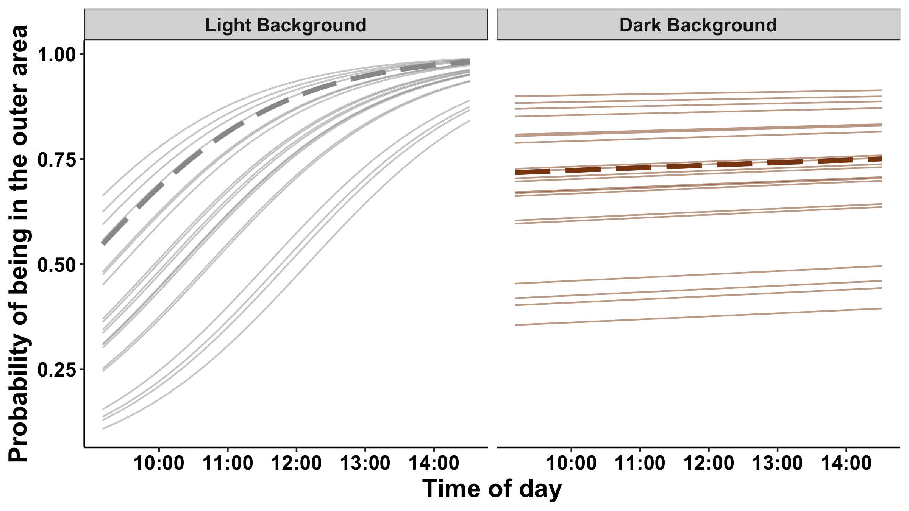
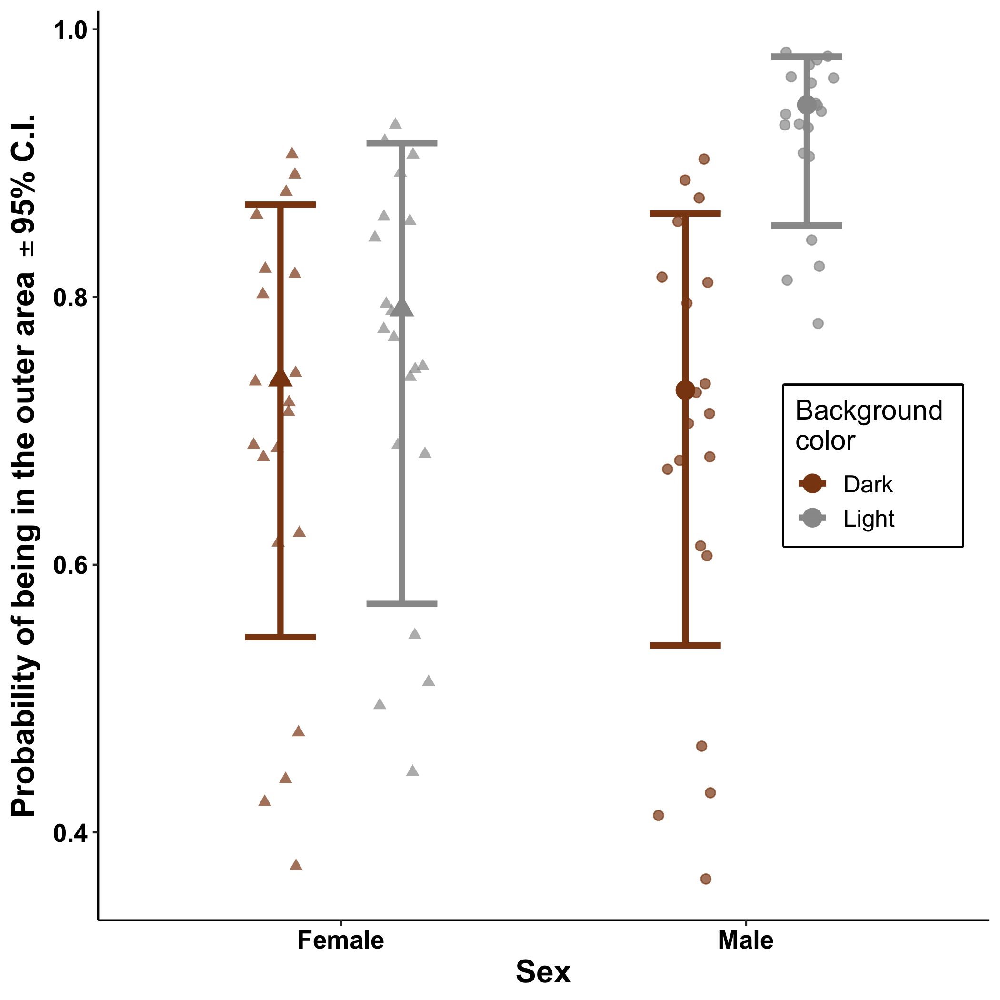

# Figures

  - Author: Paul Q. Sims
  - Contact: <paul.q.sims@gmail.com>
  - Date: 2020
  - Purpose: Figures for Lafferty et al. 2020

<!-- end list -->

``` r
knitr::opts_knit$set(root.dir = rprojroot::find_rstudio_root_file(),
                     eval = TRUE, echo = TRUE, message = FALSE,
                     warning = FALSE)
knitr::opts_chunk$set(root.dir = rprojroot::find_rstudio_root_file(),
                      fig.path = "../figs/",
                     eval = TRUE, echo = TRUE, message = FALSE,
                     warning = FALSE, dev = c("png", "pdf"), dpi = 300)
```

## Setup

``` r
# Load libraries
library(tidyverse)  # for cleaning and modifying data
library(lme4)  # glmer models
library(glmmTMB)  # for activity analyses
library(ggplot2)  # for plots
library(ggeffects)  # marginal effects

# Load personalized functions
source("R/custom-functions.R")

# Read in data 
# Data collected once each day
data_day <-
  read_csv("data/data_day_LaffertyEtAl_2020.csv",
           col_types = list(exit_fast = col_factor(),
                            trial = col_factor(levels = c("1", "2")),
                            sex = col_factor(levels = c("Female", "Male")))) %>%
  mutate(obsID = 1:nrow(.),  # observation level random effect
         expl.y = cbind(uniq_tiles, tile_fails))  # cbind successes/fails

# Data collected at time points throughout the day
data_time <-
  read_csv("data/data_time_LaffertyEtAl_2020.csv",
             col_types = list(trial = col_factor(levels = c("1", "2")),
                              sex = col_factor(levels = c("Female", "Male")),
                              of_loc = col_factor(levels = c("Inner", "Outer")),
                              bkgrd = col_factor(levels = c("Light", "Dark")))) %>%
  mutate(obsID = 1:nrow(.),  # observation level random effect
         across(where(is.character), ~ as_factor(.x)))  

# Data collected at time points throughout the day for lines crossed
data_act <-
  read_csv("data/data_activity_LaffertyEtAl_2020.csv",
             col_types = list(trial = col_factor(levels = c("1", "2")),
                              sex = col_factor(levels = c("Female", "Male")),
                              loc = col_factor(levels = c("Inner", "Outer")),
                              backg = col_factor(levels = c("Light", "Dark")))) %>%
  mutate(obsID = 1:nrow(.),  # observation level random effect
         across(where(is.character), ~ as_factor(.x)))  
```

## Figure 2: Activity during the day

``` r
# Create data set without NA values
data_act_na <- 
  remove_dat_na(data_act, c("line_cross", "t_point", "t_point_sc", "trial", "mass_sc",
                             "sex", "ID", "trial_series", "day", "obsID",
                             "backg", "loc", "shel_dur"))

# Build model
m_act_plot <- 
  glmmTMB(line_cross ~ t_point_sc + trial + mass_sc + backg +
            sex * loc +
            (1|ID) + (t_point_sc|trial_series),
          data = data_act_na,
          ziformula= ~ 1,
          family="nbinom2", 
          contrasts = list(trial = c(-1,1), sex = c(-1,1),
                           loc = c(-1,1), backg = c(-1,1)))

# Extract predicted values for population level
dat_act_pred_pop <- as_tibble(ggeffect(m_act_plot, terms = c("t_point_sc [all]"),
                                       type = "fe"))
# Extract predicted values for individual level
dat_act_pred_ind <- as_tibble(ggpredict(m_act_plot, terms = c("t_point_sc [all]", "ID [all]"),
                                        type = "re"))

# Figure out time breaks/labels for x axis 

dat_time_lab <- 
  data_act_na %>%
    select(t_point) %>%
    mutate(t_point_sc = scale(t_point)) %>%
    filter(t_point %in% c(4, 8, 12, 16, 20)) %>%
    arrange(t_point) %>%
    distinct(.) 

t_point_breaks <- dat_time_lab$t_point_sc  # x axis breaks
t_point_labs <- c("10:00", "11:00", "12:00", "13:00", "14:00")  # x axis labels
line_breaks <- seq(from = 0,
                   to = round(max(dat_act_pred_ind$predicted),  # y axis breaks
                                        digits = -1),
                   by = round(max(dat_act_pred_ind$predicted),
                              digits = -1)/4)  

# Plot

p <- ggplot(data = dat_act_pred_pop, # pop level data
            aes(x = x,
                y = predicted)) +
  geom_line(data = dat_act_pred_ind, # ind level data
             aes(y = predicted,
                 x = x,
                 group = group),
                 alpha = 0.70) +
  geom_line(size = 1.5,  # pop mean line
            lty = "longdash") +
  scale_y_continuous(breaks = line_breaks) +
  scale_x_continuous(labels = t_point_labs,
                     breaks = t_point_breaks,
                     expand = c(0,0)) +  # moves lines to touch y-axis (no white space) 
  xlab("Time of day") +
  ylab("Lines crossed") +
  #ggtitle("Lines crossed") +
  theme_bw() +
  theme(panel.grid.major = element_blank(),
        panel.grid.minor = element_blank(),
        axis.title.x = element_text(face = "bold"),
        axis.title.y = element_text(face = "bold"),
        panel.border = element_blank(),
        axis.line = element_line(),
        axis.text = element_text(face = "bold", color = "black"),
        text = element_text(size = 16)) 

print(p)
```

<!-- -->

## Figure 3: Open-Field location preference during the day, by background color

``` r
# Remove NA values
data_OF <- 
  remove_dat_na(data_time, c("of_loc", "t_point_sc", "trial", "mass_sc",
                             "sex", "ID", "trial_series", "day", "bkgrd",
                             "obsID"))

# Fit model
m_OF_plot <- 
  glmer(of_loc ~ trial + mass_sc +
          bkgrd * t_point_sc +
          sex * bkgrd +
          (1|ID) + (t_point_sc|trial_series),  
        data = data_OF,
        family = "binomial", 
        contrasts = list(trial = c(-1,1), sex = c(-1,1), bkgrd = c(-1,1)),
        glmerControl(optimizer="bobyqa",
                    optCtrl = list(maxfun = 1e6)))

# Extract predicted values for population level
dat_act_pred_pop1 <- 
  ggeffect(m_OF_plot, terms = c("t_point_sc [all]", "bkgrd"),
           type = "fe") %>%
  as_tibble(.) %>%
  rename(facet = group) %>%
  mutate(group = 1) 

dat_act_pred_pop2 <- 
  ggeffect(m_OF_plot, terms = c("t_point_sc [all]", "bkgrd"),
           type = "fe") %>%
  as_tibble(.) %>%
  rename(facet = group) %>%
  mutate(group = 2) 

# combine into one so you can facet with one slope per facet
dat_act_pred_pop <-
  rbind(dat_act_pred_pop1, dat_act_pred_pop2) %>%
  mutate(group = as_factor(group),
         facet = as_factor(ifelse(facet == "Light", "Light Background",
                                                    "Dark Background")))

# Extract predicted values for individual level
dat_of_pred_ind <- 
  ggpredict(m_OF_plot,
            terms = c("t_point_sc [all]", "ID [all]", "bkgrd"),
            type = "re") %>%
  as_tibble(.) %>%
  mutate(group = as.factor(group),
         facet = as_factor(ifelse(facet == "Light", "Light Background",
                                                    "Dark Background")))

## Figure out time breaks/labels for x axis 

dat_time_lab <- 
  data_act_na %>%
    select(t_point) %>%
    mutate(t_point_sc = scale(t_point)) %>%
    filter(t_point %in% c(4, 8, 12, 16, 20)) %>%
    arrange(t_point) %>%
    distinct(.) 

t_point_breaks <- dat_time_lab$t_point_sc  # x axis breaks
t_point_labs <- c("10:00", "11:00", "12:00", "13:00", "14:00")  # x axis labels

# Plot

p <- 
  ggplot(data = dat_of_pred_ind, # pop mean 
         aes(x = x,
             y = predicted,
           color = facet)) +
  geom_line(aes(group = group), # ind id
            alpha = 0.50) +
  geom_line(data = dat_act_pred_pop,
              size = 1.5,
           aes(color = facet),
           lty = "longdash") +  # pop mean
  scale_x_continuous(labels = t_point_labs,
                     breaks = t_point_breaks) +
  xlab("Time of day") +
  ylab("Probability of being in the outer area") +
  scale_color_manual(name = "Background \ncolor",
                     values = c("grey60", "chocolate4")) + # color for legend
  theme_bw() +
  theme(panel.grid.major = element_blank(),
        panel.grid.minor = element_blank(),
        axis.title.x = element_text(face = "bold"),
        axis.title.y = element_text(face = "bold"),
        panel.border = element_blank(),
        axis.line = element_line(),
        axis.text = element_text(face = "bold", color = "black"),
        text = element_text(size = 16),
        strip.text.x = element_text(size=12, face="bold"),
        legend.position = "none") +
  facet_wrap(~ facet)

print(p)
```

<!-- -->

## Figure 4: Open-Field location preference, background color and sex interaction

``` r
# Remove NA values
data_OF <- 
  remove_dat_na(data_time, c("of_loc", "t_point_sc", "trial", "mass_sc",
                             "sex", "ID", "trial_series", "day", "bkgrd",
                             "obsID"))

# Fit model
m_OF_plot <- 
  glmer(of_loc ~ trial + mass_sc +
          bkgrd * t_point_sc +
          sex * bkgrd +
          (1|ID) + (t_point_sc|trial_series),  
        data = data_OF,
        family = "binomial", 
        contrasts = list(trial = c(-1,1), sex = c(-1,1), bkgrd = c(-1,1)),
        glmerControl(optimizer="bobyqa",
                    optCtrl = list(maxfun = 1e6)))

# Extract predicted values for population level
dat_of_pred_pop <- 
  ggeffect(m_OF_plot,
           terms = c("sex", "bkgrd"),
           type = "fe") 

# Get fixed effect slopes
dat_of_pred_ind <- 
  ggpredict(m_OF_plot,
            terms = c("sex", "bkgrd", "ID [all]"),
            type = "re")

p <- ggplot(data = dat_of_pred_pop,
       aes(x = x,
           y = predicted,
           color = group,
           shape = x)) +
  geom_point(position = position_dodge(width = 0.6),
             size = 4) +
  geom_point(data = dat_of_pred_ind,
             aes(x = x,
                 y = predicted,
                 color = group,
                 shape = x),
             position = position_jitterdodge(dodge.width = -0.6),
             size = 2,
             alpha = 0.7) +
  geom_errorbar(aes(ymax = conf.high,
                    ymin = conf.low),
                width = 0.35,
                position = position_dodge(width = 0.6),
             size = 1.5) +
  xlab("Sex") +
  #ylab("Probability of being in the outer area of the open field") +
  ylab(expression(paste(bold(Probability~of~being~"in"~the~outer~area)~bold(""%+-%"")*bold("95"*"%"~C.I.)))) +
  scale_color_manual(name = "Background \ncolor",
                     values = c("chocolate4", "grey60")) + # color for legend
  scale_shape_manual(values = c(17, 19),
                     guide = F) + # shapes for sexess
  theme_bw() +
  theme(panel.grid.major = element_blank(),
        panel.grid.minor = element_blank(),
        axis.title.x = element_text(face = "bold"),
        axis.title.y = element_text(face = "bold"),
        panel.border = element_blank(),
        axis.line = element_line(),
        axis.text = element_text(face = "bold", color = "black"),
        text = element_text(size = 16),
        legend.position=c(0.87,0.5),
        legend.title = element_text(size = 14),
        legend.text = element_text(size = 12),
        legend.box.background = element_rect(colour = "black",
                                             size = 1)) 

print(p)
```

<!-- -->
